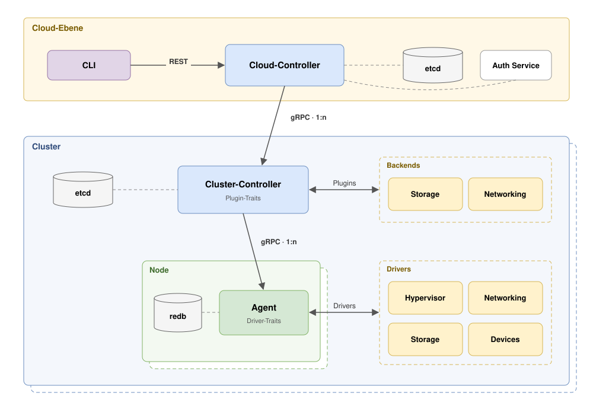

> [!IMPORTANT]
> At the moment MeisterStack is active coursework and in proof-of-concept phase. Feature requests and bug-fixes do not have high priority.

# MeisterStack

MeisterStack is a lightweight Infrastructure-as-a-Service (IaaS) tool that enables the user to mange
virtual machines, block-storage and networking resources across multiple machines in multiple clusters.
Its goal is to enable small labs and research clusters with a cloud-like experience. It's architecture
is inspired by Kubernetes, Oakestra and OpenStack.

MeisterStack supports sharing NVIDIA GPUs with its `nvrm` driver that utilizes [Project Leandro](https://github.com/UniStuttgart-IKR/Leandro).

> [!WARNING]
> The project is at the moment considered in `ALPHA` stage, [most features are proven in the lab]("docs/FEATURES.md") but to reach
> `BETA`, long-term tests and support for Linstor and Vitastor is planned to support SDS solutions.
> This project heavily used [AI for implementation and testing]("docs/AI_GUIDELINES.md"), when the project reaches `BETA` stage the generated
> code will be fully reviewed!

## Quick Start

Requirements:


Prerequisites:

```bash
./get_patched_binaries.sh
cargo build
```

Setup local etcd (one for both tiers):

```bash
etcd --data-dir /tmp/ms-dev/etcd --listen-client-urls http://127.0.0.1:2379 --advertise-client-urls http://127.0.0.1:2379
```

Setup *cloud-tier*:

```bash
cp config/examples/cloud.toml /tmp/ms-dev/cloud.toml     # uses port 3000 and 50050
target/debug/meister-cloud-controller --config /tmp/ms-dev/cloud.toml
```

Setup *cluster-tier*:

```bash
cp config/examples/cluster.toml /tmp/ms-dev/cluster.toml    # uses port 3001 and 50051
target/debug/meister-cluster-controller --config /tmp/ms-dev/cluster.toml
```

Setup *agent*:

```bash
sudo target/debug/meister-agent --config config/agent.dev.toml
```
*Note that the image `nixos.raw` has to sit in `../images` relative to the config.


Create  *CLI-profiles*:

CLI-profiles are files that hold an endpoint and the required credentials. This makes it more easy to specify to which layer you want to talk.
For this example you can jsut use the `config/cli.dev.toml` or specify `--endpoint "http://127.0.0.1:3000" before each command.

```bash
cp config/cli.dev.toml ~/.config/meisterstack/config.toml
```

Use MeisterStack:

```bash
meister api-resources
meister whoami

meister node ls --cluster cluster-1   # the agent must show up here before a VM can land
meister tenant create lab
meister image create nixos.raw --source /absolute/path/to/images/nixos.raw
meister vm create -t lab -f config/json/plain.json demo
meister vm ls -t lab
meister vm logs demo

meister --endpoint http://127.0.0.1:3001 vm ls   # to talk to the cluster-level API
```

See [Deployment](docs/DEPLOYMENT.md) for further information. A special deployment tool `meister-deploy` is under active development.

## Architecture



MeisterStack is organized in three tiers. The *Agent* that runs locally on the hypervisor. The *Cluster-Controller* and the *Cloud-Controller*
that act as two tiered, *etcd* backed control-plane. *Plugins* and *Drivers* allow to utilize traits and abstract capabilities on specific devices
and adapt to other software stacks at compile time. The three tiers of the system communicate via *gRPC* and use an three-tiered, Kubernetes inspired
reconcile mechanism to control the cloud.
The control-plane supports high-availability on both levels, for the future it is planned to make the cluster-controller more modular to adapt more easy
to already existing solutions for storage and networking like `OVN/OVS` and software defined storage of any kind.

See the [docs](docs/ARCHITECTURE.md) for more detailed information.

## License

The project is opensource and under MIT License.

