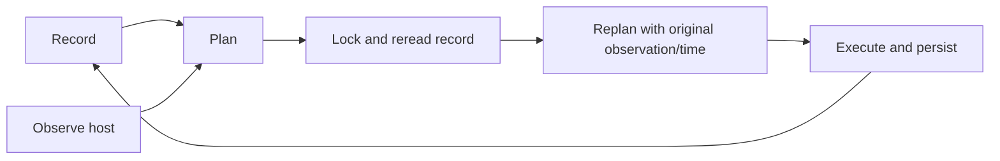

# Agent

Node-local Linux resource manager. Supports controller sessions and standalone operation. The Unix API exposes inspection and optional `debug-mutations` lifecycle commands. See [API](API.md) and [deployment](DEPLOYMENT.md).

## Four different kinds of state

| State | Meaning | Persistence |
| --- | --- | --- |
| Desired | Running, Paused, Stopped, Absent; Halted reserved | VM record |
| Phase | Resource checkpoint, including Receiving/Migrated; not guest liveness | VM record |
| Observation | Process identity, cgroup membership, driver tracking, socket and guest/backend state | Per pass/report |
| Operation | Exclusive VM ownership during snapshot, restore or migration; blocks reconciliation | VM record |

`Provisioned` does not imply Running. VM status combines record and observation; volume/snapshot status records the latest operation result. [Types](../components/agent/src/types.rs) · [Reporting](../components/agent/src/reconcile/observe.rs).

Observation runs outside the operations lock. [Execution](../components/agent/src/reconcile/act.rs) revalidates intent after locking; drivers must still tolerate host changes after observation.

## Reconciliation and lifecycle

[Planner priority](../components/agent/src/reconcile/plan.rs):

| Order | Condition | Action |
| --- | --- | --- |
| 1 | Operation marker | Wait, including before deletion |
| 2 | Absent / Stopped | Teardown / request shutdown, then force stop at deadline; paused/stopped guests skip grace |
| 3 | Unhealthy marker | Block automatic repair; lifecycle intent clears quarantine |
| 4 | Halted / Receiving / Migrated | No action / observe arrival or receive failure / suppress repair |
| 5 | Unfinished chain, dead VMM or unresponsive socket | Provision; adopt responsive untracked VMMs with recorded PIDs where eligible |
| 6 | Readable guest state | Start, pause or resume toward intent; unknown state waits |

| Runtime setting | Default/behavior |
| --- | --- |
| Reconcile / status interval | 30 s / 10 s |
| Actions per pass | Up to four |
| Periodic repair backoff | 60 s initially; exponential, capped at 15 min |
| Retry state | Memory only; new intent resets it; restart loses counters |
| Quarantine | Three ineffective accepted resumes, or backend loss under a live VMM; persisted across restart |

[Provisioning](../components/agent/src/provision/mod.rs): persist intent → images → cgroup → volumes → NICs → devices → optional NoCloud seed → boot or receive. Persist completed handles/stages; attempt cleanup on failure.

| Operation | Resource effect |
| --- | --- |
| Stop | Ends VMM and attempts backend cleanup; keeps data and taps |
| Teardown | Also removes VM-owned networking, devices, seed and inline disks; deletes record after collected failures clear |
| Referenced volume cleanup | Detach only; independent data survives |
| Successful volume detach | Persist closed marker to avoid repeating cleanup after restart |

**Limitation:** teardown continues after VMM/device/detach failures and may delete inline data after failed detach. A retained row does not guarantee intact data. [Teardown](../components/agent/src/provision/teardown.rs) · [Resource lifecycle](RESOURCE_LIFECYCLE.md).

## Persistence, startup and shutdown

- [redb](../components/agent/src/store.rs): VM records, migration receipts, volume/snapshot records and unattached inline-volume handles. Process handles, retry state, console sessions and driver maps are memory-only.
- [Startup](../components/agent/src/lib.rs): open store; screen prerequisites; [build registry](../components/agent/src/drivers.rs); adopt volumes; prepare provider bridges; sweep with ownership checks; reconcile.
- Missing KVM access for a configured hypervisor is fatal. Other unavailable drivers may be omitted with node conditions. Advertise built capabilities; refreshing conditions does not rebuild the registry. Capacity/machine profile are sampled at startup.
- Controller snapshots may reap eligible controller-managed VMs, never local unmanaged VMs.
- Shutdown preserves guests and unresolved transfers, attempts a final report with bounded wait, and silences routers. Queueing is not receipt. Session loss also triggers best-effort router silence; see [networking](NETWORKING.md).

| Inventory path | Limitation |
| --- | --- |
| Stray/overlay cleanup | Corrupt raw VM rows retain ownership and block unsafe sweeping |
| VM status | `Store::list` skips corrupt rows, yet reports are marked complete |
| Volume-open status | Uses that partial list; read errors yield an empty set. Absence/`open=false` does not establish writer release |
| Destructive volume guard | Checks raw VM rows under the operations lock; unreadable ownership refuses deletion |

## Volumes, snapshots and images

| Mechanism | Contract/limit |
| --- | --- |
| [Independent volumes](../components/agent/src/volumes.rs) | Provision, adopt, grow, snapshot, restore, forget or delete without a VM |
| [Hotplug](../components/agent/src/provision/volumes.rs) | Eligible secondary referenced disks only; attach backend before VMM add; confirm unplug before detach. Excludes boot position and inline disks |
| Resize | Grow provider first; notify VMM by stable volume-derived disk ID |
| Snapshots | Backend consistency and coordination of every writer are separate; see [storage](STORAGE.md) and [drivers](DRIVERS.md) |
| [Downloads](../components/agent/src/images.rs) | curl with idle/time/byte limits; SHA-256 verification; publish cache file, then catalogue link |
| Cache identity | UID + digest; digest alone for legacy sources. Existing entries are trusted without rehashing |
| Path images | Presence check and one hash per process; replacement can leave a stale digest. Directory inventory proves presence only |
| Shared staging | No distributed lock; temporary-file cleanup does not establish writer death |
| [NoCloud seed](../components/agent/src/cloudinit.rs) | FAT12 from supplied spec; no content fetching or guest-execution validation |

## Migration and consoles

- [Migration](MIGRATION.md): durable attempt IDs and repair barriers. Source acceptance does not establish arrival; unknown outcomes retain ownership across restart.
- **Receiver gaps:** Cloud Hypervisor API timeout/transport errors become receive-failure evidence; Receiving reconciliation does not adopt an untracked receiver after restart. Planner deadline tests do not cover these adapter paths.
- [Serial recorder](../components/agent/src/attach.rs): records the serial socket and permits one interactive holder. Attach receives subsequent output; logs provide the saved tail. Local and controller clients share holder rules.
- [Log handling](../components/agent/src/console.rs): virtio-console file and recorded serial output; best-effort hole punching retains tails without reducing logical length. VMM diagnostics are separate; nonempty diagnostics may survive teardown.

## Verification boundaries

- [Decision table](../components/agent/tests/plan_enumeration.rs) and [properties](../components/agent/tests/plan_properties.rs): 179,200 representative inputs; modeled convergence assumes successful actions.
- Provisioning fakes check ordering and ownership, not hardware behavior.
- Ignored [receive](../components/agent/tests/receive_abort_ch.rs), [input](../components/agent/tests/input_ch.rs), [unprivileged](../components/agent/tests/unprivileged_ch.rs) and [VMM isolation](../components/agent/tests/stufe3_ch.rs) tests require external binaries, images, devices or delegated cgroups; see module prerequisites.
