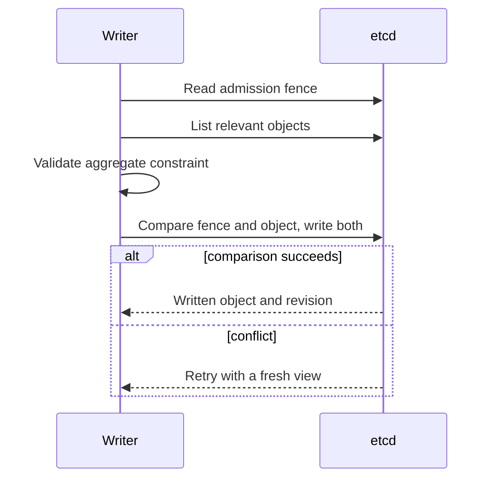
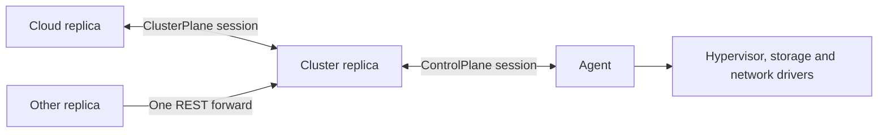

# API and shared contracts

MeisterStack exposes resource APIs at `/apis/meister.io/v1`. Cloud and cluster
controllers share object types and request rules, but serve different resources
and operations. Discover an endpoint before constructing requests.

## Discovery and schemas

`GET /apis/meister.io/v1` is available without authentication. Its
`APIResourceList` identifies the tier, authentication chain, resource names,
verbs, subresources and supported features. A resource's `tenantScoped` flag
comes from the authorization policy; it does not grant access. Feature names
advertise behavior such as dry run and selectors.

`GET /apis/meister.io/v1/schemas` returns the served kinds' JSON schemas and
mutability tables. These tables come from the same definitions used by update
handlers: fields may be immutable, server-owned or subject to a structural
comparison. The discovery `observedGeneration` list identifies kinds that expose
that field. `whoami` reports the caller and the grant resolved at this tier.

Sources: [discovery](../shared/controller-api/src/rest/discovery.rs),
[schemas](../shared/controller-api/src/rest/schemas.rs),
[request identity](../shared/controller-api/src/rest/guard.rs).

## Objects and identity

A resource has `apiVersion: meister.io/v1`, `kind`, `metadata`, `spec` and, where
applicable, `status`.

| Field | Meaning |
| --- | --- |
| `metadata.name` | Human-facing name, unique within the resource collection. |
| `metadata.uid` | Object incarnation. Recreating a name creates a different identity. |
| `metadata.resourceVersion` | etcd modification revision used for conditional writes. |
| `metadata.generation` | Client spec revision; 1 on creation, incremented on a changed spec. |
| `metadata.labels`, `annotations` | Selection and auxiliary metadata. |
| `metadata.deletionTimestamp`, `finalizers` | Requested deletion and remaining cleanup obligations. |
| `spec` | Requested configuration, including controller-owned placement fields. |
| `status` | Observations and derived state maintained by controllers. |
| `status.observedGeneration` | Spec generation the resource's reconciliation path has acted on. |

Generation does not advance for metadata changes or controller placement writes.
Resource version advances on persisted writes of any kind. An observed generation
alone is not a universal completion signal: check phase and resource-specific
observations, such as attached volumes. Older stored objects default generation
to zero.

Names use lowercase ASCII DNS-label rules and at most 63 bytes. Image and
FloatingIp names additionally permit internal dots; traversal is forbidden.
Tenant ownership is a resource field, not a separate URL namespace. Names remain
collection-wide, so two tenants cannot independently create the same VM name.

The stored resource table includes VMs, nodes, clusters, images, tenants, users,
certificate requests, floating pools and addresses, routed subnets, provider
networks, routers, storage pools, volumes, snapshots, secrets and migrations.
Counters, capacity reservations and console tickets support internal coordination.
Events are expiring observations. Discovery determines which of these a particular
endpoint exposes.

Sources: [object envelope](../shared/controller-api/src/object.rs),
[resource table](../shared/controller-api/src/resources/mod.rs),
[name validation](../shared/controller-api/src/store.rs).

## Writes, conflicts and deletion

PUT updates the spec and writable metadata. It requires `resourceVersion`, keeps
the authoritative UID and finalizers, and rejects an altered status. A client may
omit status or echo the stored status; the joined heartbeat timestamp is excluded
from this comparison. Field ownership checks still apply.

PATCH uses JSON merge patch: objects merge recursively, `null` removes a member,
and arrays or scalar values replace the previous value. It rejects a status
member and passes the resulting object through update validation. With an explicit
resource version, a conflict is returned immediately. Without one, the shared
helper repeats read/merge/write at most three times on a CAS conflict.

A successful DELETE can return `Status` with HTTP 200 and reason `Deleted`, or
HTTP 202 and reason `Deleting` while finalizers remain. Deletion acceptance does
not mean a guest stopped or storage was removed. See
[resource lifecycle](RESOURCE_LIFECYCLE.md) for cleanup ordering and ownership.

`?dryRun=All` is the supported preview spelling on handlers that advertise it.
Validation and admission run, but the preview is not persisted. It has an empty
resource version and annotation `meister.io/dry-run: "true"`. Previewed allocations
are not reserved and may change before the real request.

`labelSelector=k=v,k2=v2` is a conjunction of equality terms. It does not implement
Kubernetes set expressions. A tenant query filter narrows an already authorized
view; it does not change permissions.

Errors use a `Status` envelope with `reason`, `message`, `code` and optional
`details`, including a field path when available.

| HTTP status | Typical meaning |
| --- | --- |
| 400 | Malformed request JSON. |
| 401 / 403 | No accepted credential / insufficient permission. |
| 404 | Missing object or route. |
| 409 | Existing name, terminating object or conditional-write conflict. |
| 422 | Invalid field, shape or requested transition. |
| 503 | Store timeout or temporarily unavailable operation. |
| 500 | Other backend failure. |

Sources: [PUT and PATCH](../shared/controller-api/src/rest/patch.rs),
[mutability](../shared/controller-api/src/rest/mutability.rs),
[REST helpers](../shared/controller-api/src/rest/mod.rs),
[status responses](../shared/controller-api/src/rest/status.rs).

## VM documents and phases

The VM resource uses camelCase outside `spec.vm`; the embedded agent document
uses snake_case, including `memory_mib`, `base_image` and `cloud_init`. The API edge
validates the shape with shared agent field types. Cloud-init may name
`user_data_from`; the cluster resolves the secret before sending literal user data
to the agent. Device, image-file and local driver checks remain on the node.

The VM's boot volume, inline disk definitions and remaining machine configuration
are structurally immutable. Referenced volumes after the boot entry can change for
hot-plug. Inline disks share the VM lifecycle; referenced Volume objects have
independent ownership and deletion rules.

A phase is an evidence-bearing value, exposed as flat `phase`, `reason`, `message`
and `since` fields. The corresponding `XPhaseKind` is the comparable enum used in
policy and metrics. Reports retain their source and observation time separately.
Before encoding a resource, the store calls its pure `settle` implementation to
derive phase from its current facts. Repeating the same kind preserves `since`;
it is not a heartbeat timestamp. Unknown reason strings remain visible in messages
when an older reader cannot map them to its reason enum.

VM phases include Pending, Provisioning, Running, Stopped, Paused, Failed,
Quarantined and Unknown. Unknown records lost knowledge of the holder; it is not
proof of a stopped guest and does not become Failed after a timer. Quarantined
requires recovery outside normal automatic lifecycle reconciliation. Migration
phases and recovery evidence are described in [Migration](MIGRATION.md).

Sources: [VM fields and derivation](../shared/controller-api/src/resources/vm.rs),
[edge validation](../shared/controller-api/src/vm_spec.rs),
[agent spec](../shared/agent-api/src/spec.rs),
[phase macros](../shared/controller-api/src/resources/phase.rs),
[lifecycle decisions](../shared/controller-api/src/lifecycle.rs).

## Store and admission

Objects are JSON under `<prefix>/registry/<resource>/<name>`. Creation compares
`create_revision == 0`; update compares the supplied modification revision.
Existing leases survive updates. `mutate` retries a read/modify/CAS operation up to
eight times. Work targeting an incarnation must use `mutate_if`, which checks the
expected UID after every reread. `delete_if` compares the revision; plain delete
acts on the current name without that protection.

Rules spanning objects need more than one object's CAS. Admission fences use a
marker read before the relevant listing, then compare and advance that marker in
the same transaction as the resource write. Losing writers must rebuild the view.
Every writer that could invalidate the rule must cooperate.

Ordinary lists log and skip corrupt entries. Cleanup paths that need proof of a
complete inventory must use counted reads and compare decoded objects with the raw
response count. Missing decodable objects alone cannot authorize deletion.

Store watches wake reconciliation; they are not a durable event log. The helper
has a bounded queue and no revision replay or automatic compaction recovery.
Periodic passes preserve progress after missed events. The pass trigger retries
initial watch setup, and uses ticks when a watch closes before reconnecting.
Heartbeats are separate timestamp keys under `<prefix>/leases/`; despite that path
name, they do not use etcd TTL leases. Events and tickets do use expiry leases.

Sources: [store](../shared/controller-api/src/store.rs),
[pass triggers](../shared/controller-api/src/store.rs),
[quota accounting](../shared/controller-api/src/quota.rs),
[heartbeat expiry](../shared/controller-api/src/heartbeat.rs).

## Scheduling and sessions

Scheduling filters candidates by connectivity, schedulability, health, workload
class, CPU and memory capacity, labels, capabilities and required anti-affinity.
Empty `accepts` admits every class; a nonempty list admits only named classes.
Every VM requires a hypervisor capability. CPU overcommit defaults to 4; memory
cannot be overcommitted. The cloud's aggregate capacity is an initial filter;
cluster placement still needs a node meeting all requirements together.

FirstFit selects the first eligible candidate. Spread prefers the least hosted
workloads, with deterministic name ordering. Preferred anti-affinity and storage
locality influence selection without overriding hard constraints. Node-local
volumes pin a VM; shared pools restrict it to accessible nodes; networked storage
requires a suitable driver. Unknown locality retains a soft preference.
Outstanding migration reservations subtract capacity, and competing reservations
are ordered by etcd revision. In-pass bookings update both remaining room and
anti-affinity occupancy. The caller must still commit the binding with CAS.

Agents dial cluster replicas, and cluster replicas dial cloud replicas. The two
bidirectional protobuf services carry Hello, status, commands and interactive
console frames. Hello advertises capabilities and machine properties. UUID request
IDs correlate command acknowledgements; acknowledgement is distinct from later
runtime observation. Completeness flags distinguish an empty inventory from an
unavailable inventory. Migration commands and reports additionally carry the
attempt ID and VM incarnation.

A session belongs to one replica. Other replicas use its advertised REST endpoint
for session-bound operations, with a one-hop forwarding marker and a five-second
relay deadline. Authentication still requires the appropriate sibling identity;
the marker is not a credential. Console channels use their own session IDs on the
existing stream and close when that transport ends.

The shared dial helper uses a three-second connection timeout and HTTP/2
keepalive at ten seconds with a five-second timeout. Endpoint order uses stable
rendezvous hashing. Redial starts at 500 ms, doubles to 30 s after exhausting an
endpoint round, and resets after an established Hello or explicit rehome.
Failure requeue starts at ten seconds and caps at five minutes; policy can disable
retries or bound their count. Retry timing never establishes guest ownership.
The attribution macros validate source/AI metadata at compile time and preserve
the annotated item; they do not add runtime behavior.

Sources: [scheduler](../shared/controller-api/src/scheduler.rs),
[protocol](../shared/proto/proto/control.proto),
[dial helpers](../shared/proto/src/lib.rs),
[command correlation](../shared/controller-api/src/command.rs),
[forwarding](../shared/controller-api/src/forward.rs),
[redial](../shared/common/src/redial.rs),
[hashing](../shared/common/src/hrw.rs),
[attribution macros](../shared/macros/src/lib.rs).
