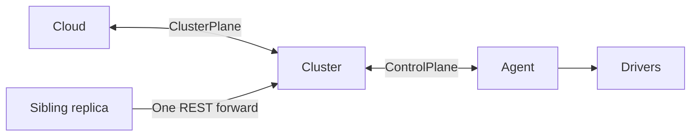

# API and shared contracts

Resource base: `/apis/meister.io/v1`. Cloud and cluster expose different resources;
discover the target endpoint first.

## Discovery and schemas

| Endpoint / field | Contract |
| --- | --- |
| `GET /apis/meister.io/v1` | Unauthenticated `APIResourceList`: tier, authenticator chain, resources, verbs, subresources, features. |
| `tenantScoped` | Authorization classification; grants no access itself. |
| `GET /apis/meister.io/v1/schemas` | Served JSON schemas and the mutability rules used by update handlers. |
| Discovery `observedGeneration` | Kinds exposing reconciliation generation. |
| `whoami` | Identity and grant resolved at this tier. |

Sources: [discovery](../shared/controller-api/src/rest/discovery.rs),
[schemas](../shared/controller-api/src/rest/schemas.rs),
[identity](../shared/controller-api/src/rest/guard.rs).

## Objects and identity

Envelope: `apiVersion: meister.io/v1`, `kind`, `metadata`, `spec`, optional `status`.

| Field | Meaning |
| --- | --- |
| `metadata.name` | Collection-wide name, including across tenants. |
| `metadata.uid` | Incarnation; changes when a name is recreated. |
| `metadata.resourceVersion` | etcd modification revision for conditional writes. |
| `metadata.generation` | Client spec revision: starts at 1; older records default to 0. |
| `metadata.labels`, `annotations` | Selection and auxiliary metadata. |
| `deletionTimestamp`, `finalizers` | Deletion request and cleanup obligations, under metadata. |
| `spec` | Intent, including controller-owned placement fields. |
| `status` | Observations and derived state. |
| `status.observedGeneration` | Generation acted on; verify phase and resource-specific observations for completion. |

- Metadata and controller placement writes do not advance generation. Persisted
  writes advance resource version.
- Names: lowercase ASCII DNS labels, maximum 63 bytes; Image and FloatingIp also
  allow internal dots. No traversal. Tenant ownership is a field, not a URL namespace.
- Public kinds cover compute, identities, networking, storage, Secrets, migrations,
  and expiring Events. Counters, reservations, and tickets coordinate internal work.
  Discovery determines the exposed subset.

Sources: [envelope](../shared/controller-api/src/object.rs),
[resource table](../shared/controller-api/src/resources/mod.rs),
[name validation](../shared/controller-api/src/store.rs).

## Writes, conflicts and deletion

| Operation | Rules |
| --- | --- |
| PUT | Requires resourceVersion; updates spec/writable metadata; preserves UID/finalizers. Status may be omitted or echoed, but not changed; joined heartbeat timestamps are excluded from comparison. |
| PATCH | JSON merge patch: recursive object merge, null removes, arrays/scalars replace. Status is forbidden; normal update validation applies. Explicit revision: immediate conflict. Omitted revision: up to three read/merge/CAS attempts. |
| DELETE | `200 Deleted` or `202 Deleting` while finalizers remain. Acceptance does not prove guest or storage cleanup. |
| `?dryRun=All` | Advertised handlers validate/admit previews. Empty resourceVersion; `meister.io/dry-run: "true"` annotation. Allocations are not reserved. |
| `labelSelector=k=v,k2=v2` | Equality conjunction only; no Kubernetes set expressions. Tenant filters only narrow authorized results. |

**Dry-run exception:** auto-approved CSR creation signs and updates User history
before checking dry-run. See [PKI limits](SECURITY.md#pki-and-oidc).

Errors use `Status { reason, message, code, details? }`, with field paths when available.

| Code | Typical meaning |
| --- | --- |
| 400 | Malformed JSON |
| 401 / 403 | Unaccepted credential / insufficient permission |
| 404 | Missing object or route |
| 409 | Existing name, termination, or CAS conflict |
| 422 | Invalid field, shape, or transition |
| 503 / 500 | Timeout or temporary unavailability / other backend failure |

Sources: [updates](../shared/controller-api/src/rest/patch.rs),
[mutability](../shared/controller-api/src/rest/mutability.rs),
[helpers](../shared/controller-api/src/rest/mod.rs),
[errors](../shared/controller-api/src/rest/status.rs),
[cleanup ordering](RESOURCE_LIFECYCLE.md).

## VM documents and phases

- Resource fields use camelCase; embedded `spec.vm` uses agent snake_case
  (`memory_mib`, `base_image`, `cloud_init`). The API validates its typed shape;
  nodes check device, file, and driver availability.
- The cluster resolves cloud-init `user_data_from` into literal user data before
  dispatch. Boot volume, inline disks, and other machine configuration are
  structurally immutable. Later referenced volumes support hot-plug.
- Inline disks follow VM lifetime; referenced Volume objects have independent ownership.
- Flat phase fields: `phase`, `reason`, `message`, `since`. `XPhaseKind` serves
  comparisons/metrics; reports separately retain source and observation time.
- Store encoding calls pure `settle` against current facts. Unchanged phase kind
  retains `since`; it is not a heartbeat. Unknown reason text survives in messages.
- VM phases: Pending, Provisioning, Running, Stopped, Paused, Failed, Quarantined,
  Unknown. Unknown is lost knowledge, not stopped or timer-converted Failed.
  Quarantined requires explicit recovery. See [Migration](MIGRATION.md).

Sources: [VM](../shared/controller-api/src/resources/vm.rs),
[edge validation](../shared/controller-api/src/vm_spec.rs),
[agent spec](../shared/agent-api/src/spec.rs),
[phase macros](../shared/controller-api/src/resources/phase.rs),
[lifecycle](../shared/controller-api/src/lifecycle.rs).

## Store and admission

| Mechanism | Contract |
| --- | --- |
| Keys | JSON at `<prefix>/registry/<resource>/<name>`. |
| Create / update | Compare create revision 0 / supplied modification revision. Preserve leases. |
| `mutate` | Up to eight read/modify/CAS attempts. |
| `mutate_if` | Rechecks expected UID after each reread; required for incarnation-specific work. |
| `delete_if` / delete | Revision-conditional deletion / deletion of the current name. |
| Admission fence | Read marker before listing; validate aggregate constraint; compare/advance marker in the object-write transaction. Conflicts require a fresh view; every invalidating writer must cooperate. |
| Lists | Log and skip corrupt entries. Cleanup needing complete inventory must compare decoded count with raw response count. |
| Watches | Bounded wakeup queue; no revision replay or automatic compaction recovery. Initial setup retries; periodic passes and reconnects recover progress after missed events. |
| Heartbeats | Timestamp keys under `<prefix>/leases/`, without TTL leases. Events and tickets do use leases. |

```mermaid
sequenceDiagram
    participant W as Writer
    participant E as etcd
    W->>E: Read fence, then list objects
    W->>W: Validate aggregate constraint
    W->>E: Compare fence/revision; write object and fence
    E-->>W: Success, or conflict requiring a fresh view
```

Sources: [store and triggers](../shared/controller-api/src/store.rs),
[quotas](../shared/controller-api/src/quota.rs),
[heartbeats](../shared/controller-api/src/heartbeat.rs).

## Scheduling and sessions

- Hard placement filters: connection, schedulability, health, class, CPU/memory,
  labels, capabilities, required anti-affinity. Empty `accepts` permits all classes.
  Every VM needs a hypervisor capability. CPU factor defaults to 4; memory cannot
  be overcommitted. Cloud aggregate fit does not prove a suitable node exists.
- FirstFit chooses the first eligible candidate; Spread minimizes hosted workload
  count with name tie-breaking. Preferred anti-affinity/locality cannot override
  hard constraints. Node-local volumes pin placement; shared pools restrict
  accessible nodes; networked storage needs its driver; unknown locality is soft.
- Migration reservations subtract capacity and order conflicts by etcd revision.
  In-pass bookings update capacity and anti-affinity; binding still requires CAS.



| Session mechanism | Contract |
| --- | --- |
| Dial direction | Agent → cluster; cluster → cloud. |
| Stream | Hello, status, commands, console frames; Hello advertises capabilities/machine properties. |
| Correlation | UUID command IDs; acknowledgment is distinct from runtime observation. Migration adds attempt ID and VM incarnation. |
| Inventory | Completeness flags distinguish empty from unavailable. |
| Forwarding | Advertised session-owner REST address; one hop, five-second deadline, matching sibling identity. Marker alone grants no access. |
| Console | Separate session IDs on the existing stream; transport closure closes channels. |
| Dial/keepalive | Three-second connect; HTTP/2 keepalive every ten seconds, five-second timeout. Stable rendezvous endpoint order. |
| Redial | 500 ms, doubling to 30 s after exhausted rounds; reset after Hello or rehome. |
| Failure requeue | Ten seconds, doubling to five minutes; policy may disable or limit retries. Timing proves no guest ownership. |

Attribution macros validate source/AI metadata at compile time without runtime behavior.

Sources: [scheduler](../shared/controller-api/src/scheduler.rs),
[protobuf](../shared/proto/proto/control.proto), [dial](../shared/proto/src/lib.rs),
[correlation](../shared/controller-api/src/command.rs),
[forwarding](../shared/controller-api/src/forward.rs),
[redial](../shared/common/src/redial.rs), [hashing](../shared/common/src/hrw.rs),
[macros](../shared/macros/src/lib.rs).
