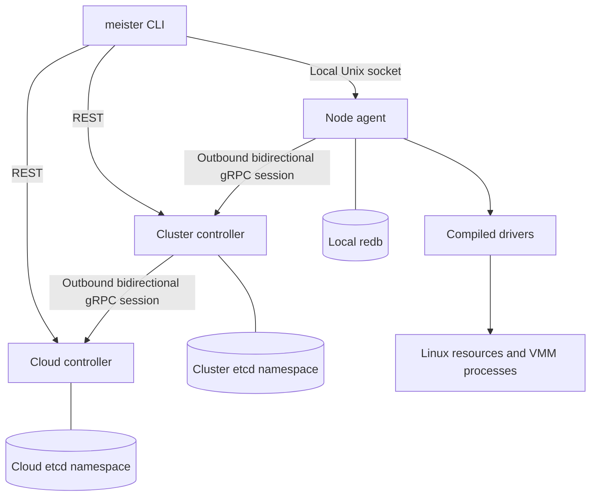
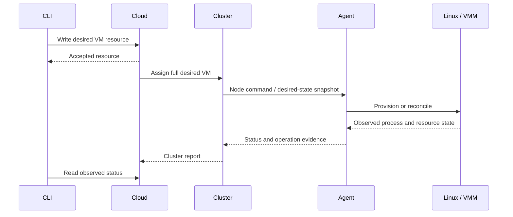

# Architecture

MeisterStack has two control-plane tiers and a node agent. The cloud selects a
cluster; the cluster selects a node; the agent reconciles Linux resources and VMM
processes. The CLI can address a controller or the agent's local Unix socket.

Session arrows show connection initiation. Commands travel back down the same
streams; reports travel up. Agents also use data-plane listeners, including
migration receivers. Outbound control sessions do not mean the node has no inbound
network services.

## State and ownership

| Layer | Authoritative local state | Derived or observed state |
| --- | --- | --- |
| Cloud | Tenants, users, global resources, full VM intent and cluster binding | Cluster capacity, placement and workload reports |
| Cluster | Node binding, local desired resources, migrations and reservations | Node inventory, process phases and volume reports |
| Agent | Local ownership records, handles, process identities and operation receipts | Kernel resources and VMM state |

The cloud stores full VM specifications, not just VM stubs. Controllers persist
resources in etcd and use revision comparisons for competing updates. Cloud and
cluster namespaces can share a development etcd instance; independent deployments
can use separate stores. Logical namespace separation does not itself provide
independent failure domains.

The agent's redb database is durable bookkeeping, not a disposable cache. Concrete
paths, backend handles and migration barriers may exist only there. Losing that
state can remove the evidence needed to distinguish an owned resource from an
orphan. External processes can survive the agent that created them.

## Reconciliation

Controllers combine store watches, queued retries, periodic reconciliation and
session reports. A successful write records intent. Agent acknowledgements usually
confirm command acceptance; later observations establish completion. Reconnection
replays desired state and reports, so handlers must tolerate duplicates and stale
messages. See [control plane](CONTROL_PLANE.md) and [agent](AGENT.md).

## Resource boundaries

- **Placement:** cloud policy chooses a cluster; cluster policy checks node
  readiness, selectors, capabilities, capacity and resource locality.
- **Storage:** volume objects express ownership and lifecycle; drivers return local
  handles. Shared reachability is distinct from exclusive writer ownership.
- **Networking:** tenant overlays, provider access and public allocation are
  reconciled separately. Local anti-spoofing protects attached interfaces.
- **Devices:** driver capabilities participate in scheduling; acquisition returns
  concrete attachments used by the VMM.
- **Migration:** a durable attempt binds source and destination evidence. Unknown
  outcome retains ownership. The receive driver and restart path have unresolved
  gaps described in [migration](MIGRATION.md).
- **Deletion:** finalizers retain objects while cleanup is incomplete. Local locks
  serialize some races but are not distributed fencing.

## Extensibility and isolation

Rust traits define hypervisor, device, network, storage and resource-limit
boundaries. Driver selection happens at build time through Cargo features and at
startup through configuration. There is no runtime plugin loader; a new driver
requires a rebuild and must implement lifecycle, recovery and cleanup contracts.

Controllers do not expose etcd directly to agents. TLS, authenticated sessions and
resource authorization define trust boundaries; the local agent socket is an
administrative interface. Details and current exceptions are in
[security](SECURITY.md).

The hierarchy reduces the amount of node detail required by the cloud, but adds
replication, asynchronous ownership transfer and recovery work. Low overhead,
scalability and fault isolation are design goals requiring measurement; the layout
alone does not prove them.
