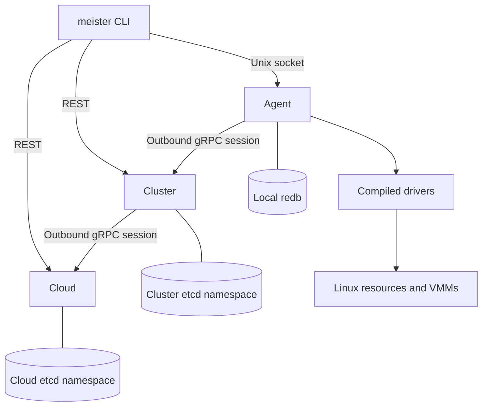

# Architecture

Cloud selects a cluster; cluster selects a node; agent manages host resources.

- Session arrows show connection initiation. Commands travel down; reports travel up.
- Migration and storage can require additional inbound dataplane listeners.
- CLI agent access is administrative; controller APIs apply resource authorization.

## State ownership

| Layer | Persists | Observes |
| --- | --- | --- |
| Cloud | Users, tenants, global resources, full VM spec and cluster binding | Cluster capacity, placement and workload reports |
| Cluster | Node binding, local intent, migrations and capacity reservations | Node inventory and resource state |
| Agent | Handles, process identities, ownership records and operation receipts | Kernel resources, backend processes and VMM state |

- Controllers use etcd revision comparisons for competing writes.
- Tier namespaces may share development etcd; this provides no separate failure domain.
- Agent redb is durable ownership state. External processes can survive the agent;
  deleting its database removes evidence needed for adoption and safe cleanup.

## Mechanisms

| Mechanism | Rule | Reference |
| --- | --- | --- |
| Reconciliation | Watch, retry, tick or report triggers a fresh state decision; handlers tolerate replay | [Control plane](CONTROL_PLANE.md), [agent](AGENT.md) |
| Completion | API acceptance records intent; command ACK and observed completion have different meanings | [API](API.md) |
| Placement | Apply health, class, selectors, capacity, capabilities and locality before choosing a candidate | [Control plane](CONTROL_PLANE.md) |
| Storage | Provider owns data; attachment owns the consumer connection | [Storage](STORAGE.md), [drivers](DRIVERS.md) |
| Networking | Reconcile overlays, provider access, allocation and local filtering separately | [Networking](NETWORKING.md) |
| Migration | Correlate durable source/destination evidence by attempt; unknown outcome retains ownership | [Contract and remaining gaps](MIGRATION.md) |
| Deletion | Finalizers retain cleanup obligations; locks do not provide distributed fencing | [Resource lifecycle](RESOURCE_LIFECYCLE.md) |
| Isolation | TLS, peer identity, object authorization and host privileges protect different boundaries | [Security](SECURITY.md) |

Drivers implement Rust traits selected by Cargo features and startup configuration.
There is no runtime plugin loader. A new driver needs a rebuild and explicit
lifecycle, restart and cleanup behavior.

Scalability, overhead and fault isolation are evaluation goals; hierarchy alone does
not establish them. [Motivation](MOTIVATION.md) records the design tradeoffs.
