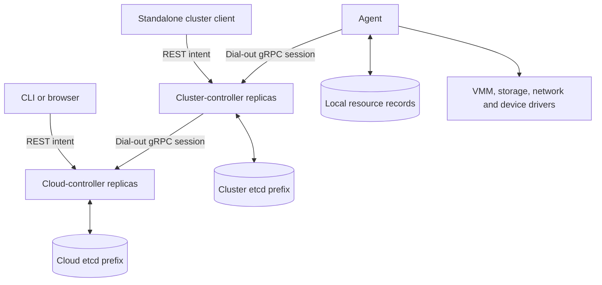

# Control plane

MeisterStack has two controller tiers. A cloud-controller owns tenant-facing
resources and assigns VMs to clusters. A cluster-controller owns node placement
and sends commands to agents. A cluster can run without a cloud connection.
Each tier persists its resources under its configured etcd prefix; agents keep
local execution records separately. Controllers coordinate intent and evidence;
they do not run the VMM or implement storage and network backends.

The entry points are [cloud main](../components/cloud-controller/src/main.rs)
and [cluster main](../components/cluster-controller/src/main.rs). The
[wire protocol](../shared/proto/proto/control.proto) defines the sessions.

## Resource ownership and requests

REST handlers validate the request envelope, field mutability and references
before writing intent. Cloud handlers also resolve the caller's directory role
and tenant. Tenant quota admission reads a shared fence before usage and compares
that fence in the resource write; contention retries the whole admission decision.
A per-resource revision comparison alone would not serialize two creates against
one quota. See [admission](../components/cloud-controller/src/api/admission.rs)
and [object authorization](../components/cloud-controller/src/api/guards.rs).

The cloud stores the original VM and its cluster binding. `CreateVm` creates a
cluster VM with a local UID and annotations identifying the cloud owner and UID.
Repeated commands must match that ownership; a reused name does not authorize
adoption of a cluster-local resource. The cluster resolves volume names to UIDs
and sends `CreateInstance` with its VM UID. Volumes deliberately preserve the
cloud UID across clusters because backend resource identity depends on it.
[Cloud command handling](../components/cluster-controller/src/cloud.rs) implements
these translations. Interactive ConsoleOpen is an exception: it carries only the
VM name, and the cluster console handler does not check cloud ownership. A local
VM with the same name can therefore be selected even when CreateVm was refused.

| Fact | Authority |
| --- | --- |
| Tenant, directory role, quota, VNI and address reservations | Cloud resources |
| VM cluster binding | Cloud scheduler |
| VM node binding, migration attempt and local pool claims | Cluster resources |
| Guest phase, attachments, backend handles and node health | Agent reports |
| Published resource phase | Shared derivation from stored intent and evidence |

A command acknowledgement has a command-specific meaning. A cluster's create
acknowledges a stored request; it does not mean the guest booted. The controllers
retain reported evidence separately from dispatch and placement facts, then derive
status. `observedGeneration` is also resource-specific: some writers stamp an
acknowledged dispatch, while attachment convergence waits for a matching report.
See [cluster VM reconciliation](../components/cluster-controller/src/reconcile/vms.rs),
[cloud VM reconciliation](../components/cloud-controller/src/reconcile/vms.rs)
and [resource state derivation](../shared/controller-api/src/resources/).

## Scheduling and reconciliation

Both tiers run periodic passes with etcd watch wakeups. There is no elected
controller leader. A bound VM normally belongs to the replica holding its child's
session. Unbound VMs may be considered by several replicas; a single CAS claims
the binding, and a losing writer does not retry its choice over the winner.
Within a pass, selection and capacity spending share a mutex so successive VMs
see capacity already spent by that pass. This is not a distributed capacity lease.

Cloud candidates use aggregate ready-node capacity and capability claims. Volume
reachability and node selectors can additionally narrow the eligible clusters;
the final node placement remains the cluster's decision. Cluster candidates
account for bound CPU/memory requests, overcommit, migration reservations,
readiness, drain, health, labels, class acceptance, devices and anti-affinity.
Referenced volumes constrain placement before the scheduler chooses. GPU profile
availability remains a capability claim rather than complete allocation
accounting. Preview placement reserves nothing, and the cluster preview currently
omits the drain flag that live placement applies.

The decision paths are [cloud placement](../components/cloud-controller/src/reconcile/placement.rs)
and [cluster placement](../components/cluster-controller/src/reconcile/placement.rs).
[Node drain](../components/cluster-controller/src/reconcile/drain.rs) may reschedule
a stopped VM, perform an allowed restart, request an in-cluster live migration,
or report a blocker. Cloud drain has no cross-cluster live migration path.
Storage reachability and the VM owner's evacuation policy constrain both.

## Sessions, restart and failure

Agents connect upward, authenticate, send Hello and then report status. Hello
creates or refreshes inventory; a disconnected peer remains an inventory object.
The cluster sends a desired-state snapshot before registering the new command
channel. An unreadable VM or unresolved secret aborts the whole snapshot because
omission can authorize agent cleanup. It still admits the session so periodic
reconciliation can continue. See [agent Hello handling](../components/cluster-controller/src/session/hello.rs).

Cluster replicas choose cloud endpoints using a shared rendezvous-hash order and
probe better-ranked endpoints periodically after failover. Several connections
can represent one cluster. A cloud replica selects one recent speaker for commands
and complete VM inventory evidence. Cluster command handling and status building
share a task, preserving their order on that stream. Incomplete inventories and
new sessions mean unknown, not empty. During rehoming, connections can temporarily
span cloud replicas; the local speaker rule does not create a global ordering.
See [cloud session loop](../components/cluster-controller/src/cloud.rs) and
[cloud registry](../components/cloud-controller/src/session/mod.rs).

Bindings, retry history, evacuation markers and migration operations survive in
etcd. Session channels, pending replies and report caches are rebuilt after a
restart. Node heartbeat expiry changes an unsupported guest observation to
Unknown; it does not prove failure or authorize a replacement guest. Stuck-phase
budgets emit diagnostics without promoting uncertainty to a terminal state.
Deletion and absence evidence differ by resource: VM cloud deletion checks report
freshness, whereas the router cloud path currently lacks that freshness gate.
[Migration](MIGRATION.md) and [resource cleanup](RESOURCE_LIFECYCLE.md) describe
their narrower recovery contracts and remaining limits.

## Deployment and trust boundaries

`listen_api` and `listen_session` are separate listeners. Replicas need a reachable
`advertise_api` for forwarding; a wildcard bind is not advertised automatically.
Logs and migration/router commands can forward to the replica holding the node
session. Interactive console forwarding from the cluster's cloud-session path
currently opens a plain TCP HTTP upgrade without sibling TLS credentials, so that
path does not work against an authenticated TLS sibling as the log path does.
See [dispatch](../components/cluster-controller/src/dispatch.rs),
[logs](../components/cluster-controller/src/logs.rs) and
[console forwarding](../components/cluster-controller/src/cloud.rs).

An empty authenticator chain is anonymous access. TLS and authentication must be
configured for an authenticated deployment. The cloud resolves ordinary users
through its directory; the cluster has no directory and refuses ordinary user
identities, while its allowed machine and break-glass identities are handled by
the shared permission policy. Configured certificate revocations are reloaded and
checked against live session serials. CSR creation with auto-approval currently
signs and updates certificate history before evaluating dry-run, so that route
must not be treated as a side-effect-free preview. See
[CSR handling](../components/cloud-controller/src/api/csrs.rs). Metrics use a separate unauthenticated
listener and expose fleet information.

Secret values are sealed in controller stores and mirrored to all connected
clusters, not only clusters currently hosting a consumer. The cluster decrypts a
referenced value when building the agent spec; the agent and guest therefore
receive plaintext. Controller-store encryption is not an end-to-end secrecy claim.
`--check-config` validates configuration without starting listeners or contacting
etcd, but it also reads a configured CRL; it does not prove backend reachability.
