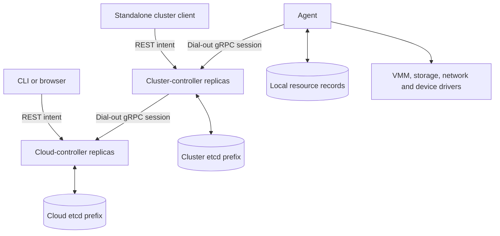

# Control plane

| Tier | Owns | Persistence |
| --- | --- | --- |
| Cloud | Tenants, directory grants, quotas, VNIs, address reservations, VM cluster bindings | Configured cloud etcd prefix |
| Cluster | VM node bindings, migrations, pool claims; standalone operation supported | Configured cluster etcd prefix |
| Agent | VMM and driver execution; reported guest, attachment and health evidence | Local resource records |

Entry points: [cloud](../components/cloud-controller/src/main.rs),
[cluster](../components/cluster-controller/src/main.rs),
[session protocol](../shared/proto/proto/control.proto).

## Resource ownership and requests

- REST validates envelopes, mutability and references; the cloud additionally
  checks directory role and tenant scope.
- Quota admission reads the tenant fence **before usage**, then compares and
  advances it with the write. Fence contention retries the whole decision;
  per-object CAS alone cannot serialize quota across creates.
- `CreateVm` creates a cluster VM with its own UID and cloud-ownership labels.
  Repeated commands must match that owner; names alone do not permit adoption.
- `CreateInstance` uses the cluster VM UID and resolved volume UIDs. Mirrored
  volumes retain the cloud UID because drivers derive backend identity from it.
- **Console exception:** `ConsoleOpen` carries only the VM name. The cluster
  handler omits cloud-ownership checks and can select a same-named local VM.

Sources: [admission](../components/cloud-controller/src/api/admission.rs),
[authorization](../components/cloud-controller/src/api/guards.rs),
[cloud command handling](../components/cluster-controller/src/cloud.rs).

ACKs are command-specific: storing a create does not prove boot completion.
Shared [phase derivation](../shared/controller-api/src/resources/) combines stored
intent and evidence. `observedGeneration` can mean acknowledged dispatch;
attachment convergence instead requires matching reports. See
[cluster VM reconciliation](../components/cluster-controller/src/reconcile/vms.rs)
and [cloud VM reconciliation](../components/cloud-controller/src/reconcile/vms.rs).

## Scheduling and reconciliation

| Mechanism | Contract / limit |
| --- | --- |
| Periodic passes + etcd watches | No elected controller leader |
| Bound VM work | Normally handled by the replica owning its child session |
| Unbound placement | Binding CAS selects one winner |
| Capacity spending | Serialized within a pass; no distributed capacity lease |
| Cloud placement | Aggregate Ready-node capacity/capabilities, volume reachability and node selectors |
| Cluster placement | CPU/memory, overcommit, migration reservations, readiness, drain, health, labels, classes, capabilities, anti-affinity and volume locality |
| GPU catalogue | Capability claims, incomplete allocation accounting |
| Preview | Reserves nothing; cluster preview currently omits the live drain check |
| Drain | Stopped relocation, authorized restart, in-cluster live migration, or blocker; no cross-cluster live migration |

Sources: [cloud placement](../components/cloud-controller/src/reconcile/placement.rs),
[cluster placement](../components/cluster-controller/src/reconcile/placement.rs),
[drain](../components/cluster-controller/src/reconcile/drain.rs).

## Sessions, restart and failure

- Agents dial upward, authenticate and send Hello. Disconnection retains inventory.
  [Hello](../components/cluster-controller/src/session/hello.rs) builds desired state
  before registering the command channel. An unreadable VM or unresolved secret
  aborts the entire snapshot: omission could authorize cleanup. Session admission
  still proceeds for periodic reconciliation.
- Cluster replicas share an HRW endpoint ranking and periodically probe preferred
  cloud endpoints. Each cloud replica selects one recent speaker. Commands and
  status share a task/stream; incomplete inventories and new sessions mean unknown.
  Rehoming can temporarily span cloud replicas without global stream ordering.
  Sources: [session loop](../components/cluster-controller/src/cloud.rs),
  [cloud registry](../components/cloud-controller/src/session/mod.rs).

| Survives in etcd | Rebuilt after restart |
| --- | --- |
| Bindings, retries, evacuation marks, migration operations | Sessions, pending replies, report caches |

Heartbeat expiry can produce **Unknown**, not proof of guest termination.
Stuck deadlines only emit diagnostics. Cloud VM deletion checks inventory
freshness; cloud router deletion currently does not. Recovery details:
[Migration](MIGRATION.md), [resource cleanup](RESOURCE_LIFECYCLE.md).

## Deployment and trust boundaries

| Boundary | Behavior / requirement |
| --- | --- |
| Listeners | Separate `listen_api` and `listen_session`; reachable `advertise_api` needed for siblings; wildcard binds are not advertised |
| Forwarding | Logs and migration/router commands reach session holders; cluster cloud-console forwarding uses plaintext HTTP without sibling credentials and fails against authenticated TLS siblings |
| Authentication | Empty chain permits anonymous access; configure authentication and TLS explicitly |
| People | Cloud directory supplies grants; cluster has no directory and refuses ordinary user identities |
| Machines | Restricted sibling/system policy and masters override; configured revocations also check live session serials |
| CSR preview | Auto-approval signs and updates certificate history before dry-run evaluation |
| Metrics | Separate unauthenticated listener exposes fleet information |
| Secrets | Sealed controller storage; mirrored to connected clusters; decrypted into agent/guest specs, without end-to-end secrecy |
| `--check-config` | No listeners or etcd contact; reads configured CRL; does not establish backend reachability |

Sources: [dispatch](../components/cluster-controller/src/dispatch.rs),
[logs](../components/cluster-controller/src/logs.rs),
[console forwarding](../components/cluster-controller/src/cloud.rs),
[CSR handling](../components/cloud-controller/src/api/csrs.rs).
