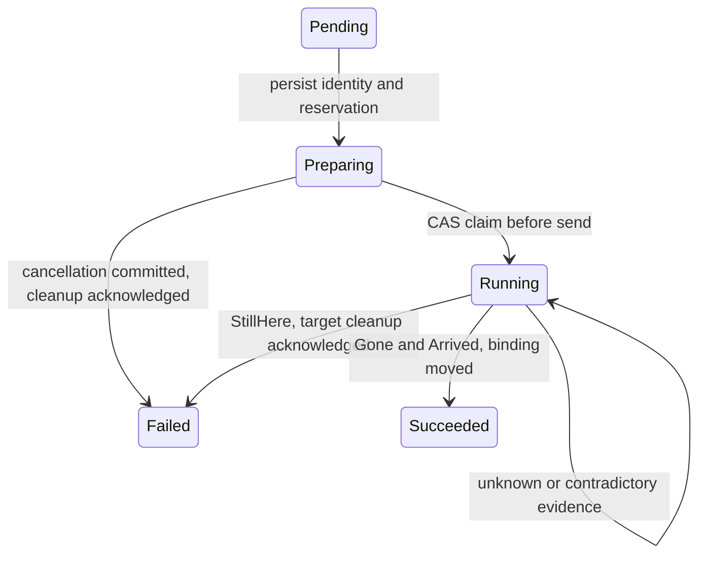

# Live migration

Cluster etcd records coordinate agent redb ownership with a VMM transfer that can
outlive either agent. **The receive adapter and restart path still violate parts
of the intended contract; see the gaps below.**

## Safety contract

- Timeout, lost reply and missing report mean unknown outcome, not failure.
- Commands/evidence identify both VM incarnation and migration attempt.
- The source `MigratingOut` repair barrier survives restart and watcher deadlines.
- Unresolved operations retain placement, destination capacity and their record.
- Commit cancellation before cleanup; concurrent send must lose the revision check.
- Cleanup requires matching attempt/role; missing ACK retains the reservation.
- Source repair while transfer ownership is unknown can create two writable guests.

## Identity and protocol

The migration resource UID becomes `status.migrationId`. Persist it with `vmUid`,
source, destination and start time before preparing the target. VM names, peer
addresses and VM UID alone cannot distinguish successive attempts.

| Message | Required identity | Meaning |
| --- | --- | --- |
| `PrepareMigration` | VM UID + attempt | Prepare receiver; return address |
| `MigrateOut` | VM UID + attempt + peer | Submit transfer; ACK means accepted |
| `MigrationReport` | VM UID + attempt + peer | Repeat durable endpoint evidence |
| `CleanupMigration` | VM UID + attempt + endpoint role | Conditionally clean cancelled target or departed source |

Reports must match operation UID, VM UID, reporter, phase and source peer, including
inside CAS retries. Older progress cannot overwrite terminal evidence. Ordinary VM
phases and legacy error text are not migration evidence.

## Controller decisions

Public phases: Pending, Preparing, Running, Succeeded, Failed.
`recoveryRequired` keeps uncertainty nonterminal; `cancelling` records no further dispatch.

| Evidence | Action |
| --- | --- |
| Missing, Sending, Unknown, old Receiving | Wait; mark recovery required after budget |
| Gone without Arrived | Retain operation and reservation |
| StillHere without target guest | Cancel; request matching target cleanup |
| StillHere plus target guest | Retain both; require recovery |
| Gone plus Arrived | CAS-move VM binding; release reservation; clean departed source |

- Gone establishes recorded source-process absence, not successful delivery.
- An arrived target retains its incoming attempt so an old reconnect snapshot cannot
  classify it as orphaned. Explicit lifecycle deletion is a separate path.
- Volume-home settlement remains best effort before Succeeded; failure can leave
  volume routing stale without a terminal-operation retry.

## Persistence and restart

| State/window | Behavior |
| --- | --- |
| Before send | Persist source attempt and barrier; write accepted only after driver ACK |
| Unacknowledged send / paused source | Keep barrier; no automatic provision/start/resume |
| Source exits before outcome save | Persist Migrated before detaching volumes |
| Watcher deadline | Retain barrier and report Unknown; later evidence may resolve it |
| Target receiving | Shutdown retains process; restart adoption is currently incomplete |
| Target arrived before binding moves | Persist/report attempt; protect from snapshot orphan cleanup |
| Cancellation awaiting cleanup ACK | Retry conditional cleanup; retain capacity |

`migration_attempts` receipts are keyed by VM UID + attempt, written before side
effects, retained after VM-row deletion and never garbage-collected. They reject
replayed sends/prepares; a cancellation receipt can precede a delayed prepare.
A crash between receipt and VM-operation persistence can require manual recovery.

StillHere requires durable send acceptance plus explicit source ownership evidence;
the current driver probes `vm.counters`. An unsuccessful probe proves no outcome.
Record-level receive deadlines are advisory; explicit cleanup also checks for an
already received guest.

## Unresolved implementation gaps

| Finding | Source path | Consequence / required regression |
| --- | --- | --- |
| AD-M1: receive API error becomes failed receive | [API](../drivers/cloud-hypervisor/src/api.rs) `receive_migration` → [process](../drivers/cloud-hypervisor/src/process.rs) `receive_failure` → planner | Timeout/transport loss can authorize teardown while VMM work continues. Test delayed/lost reply with a live receiver. |
| AD-M2: Receiving bypasses adoption | [observe](../components/agent/src/reconcile/observe.rs), [plan](../components/agent/src/reconcile/plan.rs) | Fresh driver map cannot observe surviving receiver arrival. Test reopened store + new driver + existing receiver. |
| CT10: best-effort volume-home update | [controller migration](../components/cluster-controller/src/migration.rs) `settle` | Succeeded can retain stale volume home. Inject home-write failure before source forgetting. |

These are source findings; no live migration reproduction or fix belongs to this
comment/documentation change. Planner fakes do not validate adapter evidence semantics.

## Version compatibility

- New commands require nonempty attempt IDs; controllers require
  `migration/attempt-v2` on both endpoints before reservation/preparation.
- Additive protobuf fields decode missing IDs as empty. Forwarding must preserve IDs;
  there is no fallback to legacy migration semantics.
- JSON defaults preserve ordinary records. Legacy source barriers remain blocked;
  old nonterminal controller attempts require recovery instead of invented identity.
- Settle attempts and pause admission before upgrading participating agents and all
  controller replicas. Do not downgrade with unresolved ownership records.
- Older binaries may ignore new fields or apply old timeout rules. Decoding
  compatibility does not establish safe mixed-version migration.
- No automatic fencing or force-recovery API exists. Establish actual VMM/writer
  ownership before changing records; deleting a marker is not a recovery procedure.

## Tests and source map

| Concern | Source / regression |
| --- | --- |
| Timeout, identity, late reports | [controller migration](../components/cluster-controller/src/migration.rs): `delayed_completion_reports_never_authorize_timeout_cleanup`, `old_reports_cannot_change_a_new_attempt_before_or_after_dispatch` |
| Source barrier, restart, late completion | [agent migration](../components/agent/src/provision/migrate.rs), [tests](../components/agent/src/provision/tests/migrate.rs): `restart_keeps_an_unresolved_source_protected`, `deadline_keeps_ownership_and_later_evidence_resolves_the_same_attempt` |
| Replay and cleanup | [store](../components/agent/src/store.rs), [migration tests](../components/agent/src/provision/tests/migrate.rs): `cleanup_is_attempt_bound_and_cancel_before_prepare_survives_restart` |
| Advisory receive deadline | [planner tests](../components/agent/src/reconcile/tests.rs): `a_receive_deadline_does_not_authorize_cleanup`; excludes AD-M1/M2 |
| Legacy decoding | [record types](../components/agent/src/types.rs), [migration tests](../components/agent/src/provision/tests/migrate.rs): `legacy_records_load_without_inventing_attempt_evidence` |
| Real etcd | [controller tests](../components/cluster-controller/src/migration.rs): `timeout_retains_reservation_and_accepts_late_completion_reports`; requires etcd |

Temporary redb and driver doubles test orchestration/process restart, not power loss
or live VMM transfer. Remaining limits include indefinite uncertainty, unbounded
receipts and no distributed fencing. See [testing](TESTING.md).
