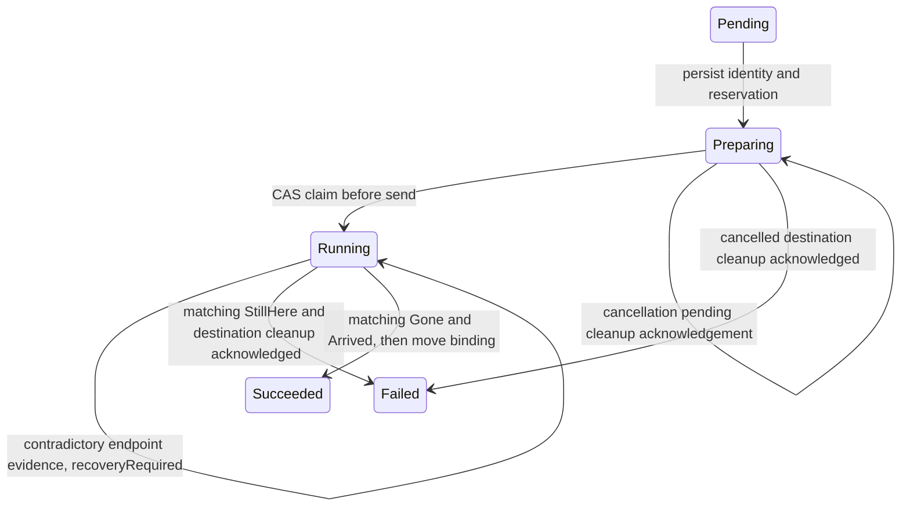

# Live migration: ownership, evidence and recovery

This document describes the implemented migration safety contract. It is a technical
basis for architectural discussion and evaluation, not a formal proof or a claim of
successful hardware testing. The implementation coordinates a cluster-controller
record in etcd with durable endpoint records in each agent's redb database. The VMM
owns the actual transfer and can outlive either agent process.

## Safety properties

1. Missing reports, a lost command reply and an expired deadline do not establish
   failure. They never authorize destination destruction or automatic source repair.
2. Every migration command and report identifies both the VM incarnation and the
   migration attempt. Evidence from one attempt cannot settle another attempt.
3. The source's `MigratingOut` repair barrier survives agent restarts and watcher
   deadlines. Only established terminal evidence releases it.
4. An unresolved controller operation is nonterminal. Its placement and destination
   capacity reservation remain in place, and its ownership record cannot be deleted
   through the cluster API.
5. Cancellation is committed before destination cleanup. A competing send must lose
   the etcd revision comparison. Cleanup is conditional on the agent's matching
   attempt, and missing cleanup acknowledgement keeps the reservation.

These properties deliberately prefer retaining an unresolved operation over
restarting a potentially duplicated guest. In particular, a transfer pause is not
permission to resume the source. This matters when both nodes can access writable
storage: automatic source repair could introduce two writers.

## Identity and messages

The controller uses the migration resource's immutable `metadata.uid` as the attempt
ID. Before preparing the destination it persists that ID as `status.migrationId`,
together with `status.vmUid`, source, destination and the start time. The VM UID
identifies an incarnation; it cannot distinguish repeated migrations of that same VM.
Resource names and peer addresses are also insufficient as attempt identities.

| Message | Identity | Meaning |
| --- | --- | --- |
| `PrepareMigration` | VM UID, migration ID | Build a receiving endpoint; reply with its address. |
| `MigrateOut` | VM UID, migration ID, peer | Start sending. An acknowledgement means accepted. |
| `MigrationReport` | VM UID, migration ID, peer | Repeat durable evidence from either endpoint. |
| `CleanupMigration` | VM UID, migration ID, endpoint role | Conditionally remove the cancelled destination or departed source. |

A `MigrateOut` error string is never an abort certificate. The controller no longer
interprets the historical sentence `The guest was not given up` as authority to
clean up. An untyped driver error can mean that the request failed before delivery
or that its reply was lost after delivery; the source retains its barrier in either
case.

Reports are checked against the current operation, VM incarnation, expected node,
phase and, for source reports, peer address. The checks run again inside the etcd
mutation retry and include the migration resource UID. Terminal endpoint evidence
is not overwritten by an older progress report. Ordinary `VmStatusReport` phases
and reports with no migration ID are not migration evidence.

## State transitions

The existing public phases remain `Pending`, `Preparing`, `Running`, `Succeeded`
and `Failed`. Unknown outcome is represented by `recoveryRequired: true` on a
nonterminal operation, together with its diagnostic message. It is not encoded as
`Failed`, because that would release ownership and admit a replacement operation.
`cancelling: true` records the irreversible decision not to dispatch this attempt.

| Evidence | Controller action |
| --- | --- |
| No report, `Sending`, `Unknown`, or old `Receiving` | Keep waiting; after the budget mark recovery required. |
| Source `Gone`, destination not yet `Arrived` | Retain both operation and destination reservation. |
| Source `StillHere`, destination not reporting a guest | Commit cancellation and request attempt-scoped destination cleanup. |
| Source `StillHere`, destination reporting a guest | Retain both endpoints and request recovery. |
| Source `Gone` and destination `Arrived` | Move the VM binding by CAS, release the reservation, clean up the departed source. |

`Gone` means the recorded source VMM process is absent. It is not, by itself, proof
that the destination received the guest: the process could also have died. Success
requires independent destination evidence for the same attempt.

A destination that has received the guest remains protected from desired-state
orphan cleanup while the controller's old binding can still omit it. The incoming
attempt is retained on that record. Explicit lifecycle deletion still exists;
absence from a reconnect snapshot alone is insufficient authorization.

## Persistence and restart windows

The source writes its attempt and `MigratingOut` barrier before calling the driver.
It persists `accepted: true` only after the driver acknowledges the send. The
background watcher is an optimization for prompt reporting; periodic and startup
reconciliation also observe the durable attempt.

| Interruption point | Recovery behavior |
| --- | --- |
| Before any VMM send | A persisted but unacknowledged attempt stays protected. |
| During send / while source is paused | Preserve the marker; do not provision, start or resume. |
| After source exit, before outcome persistence | Observe recorded process absence; persist `Migrated` before detaching volumes. |
| After watcher deadline | Keep the marker and report `Unknown`; later reconciliation can consume terminal evidence. |
| During target reception | Keep the receiver; an agent restart or stop does not cancel the VMM transfer. |
| After target arrival, before binding update | Report the durable attempt and protect it from reconnect orphan cleanup. |
| After controller cancellation, before cleanup acknowledgement | Retry the same conditional cleanup; retain capacity meanwhile. |

The `migration_attempts` redb table records command receipts keyed by VM UID and
attempt ID. Receipts are written before VMM side effects, survive deletion of the
VM row, and are not garbage-collected. Cancellation can write a receipt even before
the matching prepare arrives. Thus delayed prepares cannot recreate a cancelled
receiver, and delayed sends cannot restart a previously handled attempt. A duplicate
command is refused; retrying a command is not permission to repeat its side effect.
A crash after a receipt is written but before the VM operation is persisted can
leave a conservative refusal requiring recovery.

On the source, `StillHere` requires an acknowledged send and explicit driver
evidence that the VMM owns the guest again. The cloud-hypervisor driver currently
uses the availability of `vm.counters` for that distinction. A failed probe while
the recorded process still belongs to the VM proves neither success nor failure.
If send acceptance was never durably acknowledged, a responsive source alone does
not release the barrier.

Receive deadlines are retained in records for compatibility, but are advisory.
Only an explicit driver receive failure may trigger local failed-receive cleanup.
Agent shutdown no longer tears down receiving VMMs. The controller's conditional
cleanup also refuses a destination whose phase or observed guest state says that
it already received the guest.

## Version compatibility and upgrades

The additive protobuf fields use previously unused field numbers; missing IDs decode
to empty strings. New agents reject migration commands without an ID. New controllers
require the `migration/attempt-v2` capability on both endpoints before reserving or
preparing a new migration. The capability travels through the existing Hello driver
catalogue. Inter-controller command forwarding carries the same ID; a forwarding
path that drops it results in a refusal, not a legacy fallback.

New persisted JSON fields have defaults. Old ordinary VM records remain readable.
Legacy `MigratingOut` records with no attempt ID remain blocked after startup and
produce no fabricated attempt evidence. Old nonterminal controller migrations with
no attempt identity are retained as recovery-required; their old status strings
cannot safely be assigned a new identity retroactively.

**Operational upgrade requirement:** quiesce migration admission and settle existing
migrations before changing protocol versions. Upgrade the agents and all controller
replicas before admitting new migrations. A mixed fleet can continue ordinary VM
operations, but safe migration requires all participating components to implement
this contract. Do not downgrade agents or controllers while migrations or unresolved
ownership records exist. Older binaries may ignore the new persisted fields, clear
legacy operation markers, or apply the old timeout policy. Additive wire decoding
does not make those older semantics safe.

There is no automatic fencing service or force-recovery API in this change. For an
unresolved legacy or unacknowledged attempt, an operator must establish the actual
VMM ownership and ensure that no transfer or competing writer can resume before
changing persisted state. Merely increasing a timeout, deleting a migration record
or clearing a source marker is not a recovery procedure.

## Implementation and evaluation map

| Concern | Implementation | Regression evidence |
| --- | --- | --- |
| Timeout safety | `cluster-controller/src/migration.rs`: `verdict_on_timeout`, `unresolved`, `settle` | `delayed_completion_reports_never_authorize_timeout_cleanup` |
| Attempt validation | Same module: `apply_report`, `ingest_reports` | `old_reports_cannot_change_a_new_attempt_before_or_after_dispatch`; `reports_check_reporter_peer_phase_and_incarnation_and_survive_roundtrip` |
| Durable source barrier | `agent/src/provision/migrate.rs`: `begin_migrate_out`, `observe_send`, `finish_migrate_out`; startup reconcile | `restart_keeps_an_unresolved_source_protected`; `persisted_send_recovery_never_provisions_or_resumes_a_second_guest` |
| Late completion after deadline | Same source watcher and reconciler | `deadline_keeps_ownership_and_later_evidence_resolves_the_same_attempt` |
| Conditional cleanup and replay | `agent/src/store.rs`: `claim_migration`; provisioner's `cleanup_migration` | `cleanup_is_attempt_bound_and_cancel_before_prepare_survives_restart` |
| Receive timeout and restart | `agent/src/reconcile/observe.rs`, `plan.rs` | `a_receive_deadline_does_not_authorize_cleanup` |
| Legacy persistence | `agent/src/types.rs`, controller migration status | `legacy_records_load_without_inventing_attempt_evidence` |
| Real etcd mutation / reservation path | Controller migration reconciler and ingest | `timeout_retains_reservation_and_accepts_late_completion_reports` (requires an existing etcd) |

Paths in this table are relative to `components/` unless otherwise specified.
The deterministic agent tests use driver doubles, explicit state transitions and
real temporary redb files. They test orchestration and persistence, not the actual
VMM migration protocol. Existing privileged cloud-hypervisor tests and etcd tests
have external prerequisites and are ignored in an ordinary Cargo test run. A green
ordinary suite must not be described as a successful live migration experiment.

For thesis evaluation, distinguish the design argument above, executable regression
evidence, and integration measurements. No formal verification, live cluster
experiment, packet-loss campaign or power-loss durability experiment is implied.
Remaining limits include indefinite recovery when evidence is unavailable,
unbounded receipt-table growth, reliance on the driver's terminal-evidence semantics,
and the absence of automatic fencing. Capacity admission races outside migration
outcome handling are separate concerns.
