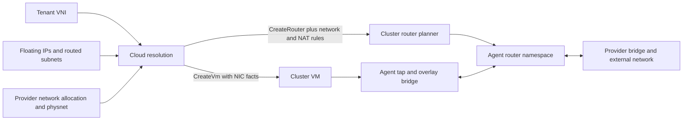

# Tenant networking

Cloud: identity and address ownership. Cluster: gateway placement. Agent drivers:
interfaces, filtering and routing. Backend configuration and upstream routing
remain deployment requirements.

## Overlays and address ownership

| Object / fact | Behavior |
| --- | --- |
| Tenant VNI | Persistent cloud allocator; cluster injects it before scheduling; requires overlay capability |
| Missing VNI | Falls back to the configured default bridge |
| FloatingIp | Reserves an address independently of VM lifetime, within pool quota |
| Routed subnet | Assigns a tenant prefix |
| NIC allowlists | Cloud resolves tenant addresses and router inside prefixes; clients cannot set cloud-owned fields |
| Guest addressing | No DHCP or guest IP configuration supplied by these objects |
| Address changes | No general live NIC update; released/reused addresses can retain stale tap permissions until dataplane rebuild |
| observedGeneration | Dispatch evidence, not a packet or convergence test |

Sources: [tenant API](../components/cloud-controller/src/api/tenants.rs),
[address APIs](../components/cloud-controller/src/api/floating.rs),
[subnet admission](../components/cloud-controller/src/api/routed_subnets.rs),
[address resolution](../components/cloud-controller/src/reconcile/floating.rs),
[NIC injection](../components/cluster-controller/src/cloud.rs).

## Routers and placement

1. `ProviderNetwork` defines physnet, allocation, prefix and gateway. Agents
   advertise reachable physnets through gateway capabilities.
2. Cloud resolves tenant VNI, internal gateway, NAT and announced prefixes;
   allocates an external address; keeps an eligible cluster binding or selects
   by router load. The provider network is mirrored with the router.
3. Cluster filters physnet, health, class, schedulability and refusal evidence;
   builds an ordered gateway list and selects an active node.
4. Sibling dispatch reaches gateways owned by other replicas. Removed placements
   remain in `status.releasing` until destruction is acknowledged, including
   cleanup after offline nodes return.

| Admission / evidence limit | Consequence |
| --- | --- |
| External-address conflicts resolved after competing writes | Eventual deterministic winner, not atomic reservation |
| Cloud router dispatch logs failures but returns success | Floating-address applied stamps can advance without delivery |

Sources: [cloud routers](../components/cloud-controller/src/reconcile/routers.rs),
[cluster routers](../components/cluster-controller/src/reconcile/routers.rs),
[shared policy](../shared/controller-api/src/network.rs).

## Node dataplane and failover

- Per-router Linux namespace: provider veth, tenant-overlay veth, routes,
  conntrack and nftables. Rules cover SNAT, floating DNAT/SNAT and routed prefixes.
- Active and standby namespaces are built. Standbys suppress ARP and announce
  no prefixes; promotion changes the existing namespace's role.
- Announcements require a routing driver and functioning upstream fabric.
  Controllers provide neither conntrack synchronization nor distributed fencing
  of an unreachable old active gateway.
- Allocation/rules are IPv4-oriented; these paths do not establish IPv6 support.

Sources: [Linux router driver](../drivers/linux-network/src/router.rs),
[FRR driver](../drivers/linux-network/src/frr.rs).

## Persistence, cleanup and operating limits

| State / operation | Persistence or limit |
| --- | --- |
| Router object, placement, release debt | etcd |
| Agent ownership records | Persist beside runtime network state across agent restart |
| Kernel namespaces | Lost on host reboot; desired routers must be rebuilt |
| Cluster router deletion | Removes the object first; agent-report cleanup may await reconnection |
| Overlay deletion | Retained for VM/router/bridge-port users; unreadable local ownership inventory blocks deletion |
| Cluster orphan sweep | Ordinary etcd listing skips corrupt Router rows and can destroy a still-owned router |
| Cloud router deletion | Requires complete cluster inventory but lacks freshness gating; stale absence can remove the cloud object before cluster deletion |
| Readiness | Cached health/capabilities and ACKs require corroboration with dataplane measurements |

[Resource cleanup](RESOURCE_LIFECYCLE.md) covers ownership guards and limits under
external interface changes.

## Linux driver details

| Area | Implemented behavior / limit |
| --- | --- |
| VXLAN | Multicast group derives from VNI's lower 24 bits; EVPN disables learning and relies on FRR |
| Interface limits | VNI ≤ 99,999; physnet name ≤ four characters; overlay MTU derives from underlay |
| Tap filtering | Source MAC on all managed taps; IPv4/ARP sources restricted on overlays when address facts or guarded pools apply; no IPv6 source filtering |
| FRR cache | In-memory prefix diff; no reconstruction after agent restart or forced refresh after FRR restart; unchanged sets skip configuration |
| Router readiness | Link presence does not verify routes or filtering rules |
| Rule refresh | Obsolete routed-subnet routes are not explicitly removed; cached nft rendering plus table existence can miss external rule edits |
| Local router inventory | Unreadable records are skipped, so partial lists cannot prove all routers absent or silent; overlay deletion uses a separate strict scan |
| Link identity | Tap/router veth names use eight UUID hex digits, with collision risk and no full-UUID link ownership check |
| Namespace recovery | A failed probe of a listed namespace is currently treated as permission to remove its name |
| Promotion | Gratuitous ARP on the external leg; internal neighbour refresh and established conntrack continuity remain separate limits |

The ignored [dataplane test](../drivers/linux-network/tests/gateway_datapath.rs)
clears neighbour caches before standby checks. It does not establish failover
with a guest retaining the old gateway MAC. See [test scope](TESTING.md).
