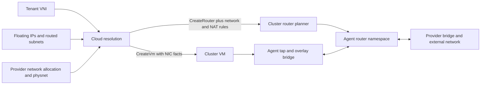

# Tenant networking

The cloud resolves tenant network identity and address ownership. The cluster
chooses gateway nodes and sends concrete router and VM specifications. The agent's
network driver creates interfaces, filtering and routing state. A configured
network backend is required for those operations; API objects alone do not create
an underlay or configure upstream routers.

## Overlays and address ownership

Tenants receive VNIs from the cloud's persistent allocation counter. A VM request
cannot choose the cloud-managed NIC VNI or address allowlists. During dispatch the
cloud resolves the tenant's VNI, assigned floating addresses and routed prefixes;
the cluster injects those facts into NIC entries before scheduling. A VNI requires
an overlay-capable node. Without a tenant VNI, the implementation falls back to the
configured default bridge. See [tenant API](../components/cloud-controller/src/api/tenants.rs),
[address resolution](../components/cloud-controller/src/reconcile/floating.rs) and
[NIC binding](../components/cluster-controller/src/cloud.rs).

Floating pools define allocatable external addresses and tenant ceilings.
`FloatingIp` records reserve addresses independently of VM lifetime. Routed subnet
objects assign prefixes to tenants. The cloud checks tenant ownership on references
and passes a VM its permitted source addresses, including private prefixes derived
from that tenant's router inside interfaces. These are permissions and routing
inputs; they do not configure the guest's IP stack or provide DHCP.
[Address APIs](../components/cloud-controller/src/api/floating.rs) and
[routed subnet admission](../components/cloud-controller/src/api/routed_subnets.rs)
manage the reservations.

NIC network facts are incorporated in the stored VM spec. Address changes do not
have a general live NIC reconfiguration path. Releasing an address reservation
does not immediately revoke the permissions on an existing tap; reusing that
address can overlap with stale guest permissions until the dataplane is rebuilt. An `observedGeneration` stamp means
a control-plane dispatch was recorded, not that traffic was measured end to end.

## Routers and placement

A `ProviderNetwork` maps a logical physnet to an external allocation, prefix and
gateway. Gateway agents advertise which physnets their configured interfaces can
serve. A tenant router joins its overlay VNI and internal gateway address to one
provider network. The cloud resolves floating-IP NAT and named routed subnets,
allocates the router's external address, and selects a serving cluster by existing
binding or eligible router load. It mirrors the provider network alongside the
router. It does not choose the gateway node.

The cluster planner filters gateway candidates by physnet, health, class
acceptance, schedulability and recorded refusals, then keeps an ordered gateway
plan and chooses an active node. Routers may span agent sessions held by different
controller replicas, so commands use authenticated sibling dispatch. Removed
placements remain in `status.releasing` until destruction is acknowledged; a node
that was unreachable when removed can be cleaned when it returns. See
[cloud router reconciliation](../components/cloud-controller/src/reconcile/routers.rs),
[cluster router reconciliation](../components/cluster-controller/src/reconcile/routers.rs)
and [shared network policy](../shared/controller-api/src/network.rs).

External-address allocation rechecks competing claims and uses a deterministic
winner when separate router writes collide. This is convergence after a conflict,
not an atomic transaction reserving the address before any other router can see it.
The cloud floating-address applied stamp also currently follows a router dispatch
wrapper that returns success after logging a rejection or transport failure, so
that field alone does not establish successful delivery.

## Node dataplane and failover

The Linux gateway driver builds a network namespace per router, with one veth leg
on the provider bridge and one on the tenant overlay bridge. The namespace owns
its routes, conntrack and nftables state. NAT rules implement outbound SNAT,
floating-address DNAT/SNAT and routed prefixes. Tap filtering constrains source
identity using the injected VM facts. The implementation is IPv4-oriented; the
allocation and rule paths described here are not an IPv6 support claim.

Active and standby gateways are both built. Standby legs suppress ARP responses
and advertise no prefixes; promotion changes activity on an existing namespace.
Announcements depend on the configured routing driver and external routing
infrastructure. The controllers do not synchronize conntrack between gateways or
fence an unreachable old active node. Connectivity and established-flow survival
therefore need separate evaluation under partitions and failover. The implementation
is in [Linux routers](../drivers/linux-network/src/router.rs) and the
[FRR driver](../drivers/linux-network/src/frr.rs).

## Persistence, cleanup and operating limits

Router resources, placement and release debt persist in etcd. The Linux driver
stores per-router records beside runtime network state so an agent restart can
identify ownership. Kernel namespaces disappear on host reboot; a desired router
must be rebuilt. Agent status exposes router state and lets the cluster sweep
routers no longer named by its resources. Cluster router deletion removes the
resource first; cleanup can wait for a disconnected node's next report.

An overlay is retained while VMs, persisted routers or remaining bridge ports
still use it. The driver blocks overlay cleanup on unreadable local ownership
inventories. The cluster router sweep has a separate limitation: its ordinary
store listing skips undecodable Router objects, so a node report can be treated
as orphaned and destroyed even while the unreadable object remains stored.
[Resource cleanup](RESOURCE_LIFECYCLE.md) explains this guard and its limits under
external interface manipulation. It does not supply distributed fencing.

Cloud router deletion waits for absence from a complete cluster router inventory,
but currently lacks the VM deletion path's timestamp freshness check. A stale
inventory can therefore remove the cloud record before the cluster saw deletion.
Likewise, cached capability and health reports are observations, not live network
probes. Use object reasons, node/router reports and dataplane measurements together
when evaluating readiness; a successful API write or dispatch is not a packet test.

## Linux driver details

- Overlay bridges use VXLAN. Multicast mode derives the group from the lower
  24 bits of the VNI; EVPN mode disables VXLAN learning and relies on FRR.
- Interface names impose narrower limits than the VXLAN field: this driver
  accepts VNIs up to 99,999 and physnet names up to four characters. Overlay
  MTU is derived from the underlay MTU.
- Every managed tap has source-MAC filtering. Overlay taps additionally restrict
  IPv4 and ARP sources when address facts or a guarded pool are configured.
  Provider taps use MAC filtering; IPv6 source-address filtering is not implemented.
- FRR announcements are diffed against an in-memory prefix set. The driver does
  not reconstruct that set from FRR after an agent restart, or force a refresh
  after an independent FRR restart. An unchanged set also skips configuration.
- Router records persist the desired specification. Link presence is used for
  readiness; readiness does not verify every route or filtering rule. Obsolete
  routed-subnet routes are not explicitly removed during ensure. A saved nftables
  rendering plus table existence can skip rule installation after external edits.
- Local router listing skips unreadable records. This differs from the strict
  ownership scan used for overlay deletion: a partial router list is insufficient
  evidence that all routers are absent or silent.

Tap and router veth names contain only the first eight hexadecimal digits of the
object UUID. A prefix collision can alias interfaces owned by different objects;
there is no full-UUID ownership check on those links. Namespace recovery also
currently treats a failed probe of a listed namespace as evidence that its name
can be removed. Probe failures need investigation before being interpreted as
absence. These limits require code changes; this review changes documentation only.

Promotion sends gratuitous ARP on the external leg. Internal neighbour refresh
and established conntrack state are separate concerns. The ignored
[dataplane test](../drivers/linux-network/tests/gateway_datapath.rs) clears neighbour
caches before checking standby behaviour; it does not cover a guest retaining the
old gateway MAC during failover. See [test scope](TESTING.md) before treating a
passing rendering or namespace test as end-to-end failover evidence.
