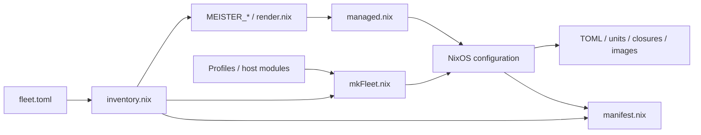

# Nix integration

Runtime/evaluation reference. Deployment commands: [Deployment](DEPLOYMENT.md).

## Public modules and packages

| Export | Contract |
| --- | --- |
| `nixosModules.services` / default | Runtime role modules: controllers, agent, etcd, data, single-node, addons, observability, RDMA. No role means no role service. Host owns firewall, DHCP, boot, filesystems, stateVersion. |
| `managed` | System-closure binaries and configuration; signed deployment support. |
| `provider-opennebula` | Optional provider initialization. |
| Overlay | Workspace, patched Cloud Hypervisor + ch-remote, virtio-input, tiny guest, operator CA. Overridable through pkgs; agent runtime joins workspace/VMM under one bin directory. |
| Package source | Workspace and embedded operator template; excludes unrelated top-level docs. |
| Default / `musl` shell | C cross-toolchain and library inputs; Rust toolchain must be installed separately. |

Workspace and hypervisor package builds disable broad runtime tests; separate
checks cover those dependencies. Sources: [flake](../flake.nix),
[overlay](../nix/overlay.nix), [recipes](../nix/packages/), [Testing](TESTING.md).

## Inventory and rendering

| Rule | Contract |
| --- | --- |
| Schema | Version 2; unknown top-level tables rejected. |
| Scalar inheritance | defaults < groups < host; equal-rank group conflicts fail. |
| List inheritance | Profiles, checks, substituters accumulate uniquely in declaration order. SSH fingerprints are host-only. |
| Identity | Host ID names deployment/node identity; hostname may differ. |
| Topology | At most one Raft group per host; group sizes 1/3/5. Agents need controller groups when clusters exist; agent-only fleets may be standalone. Cloud/cluster topology must connect; addons requires a domain. |
| Deployment type | Context hosts remain inspectable; only nixos hosts produce systems/manifest entries. |
| Paths / disks | Module/layout paths relative to inventory. Stable persistence references: label, UUID, partition label, serial. Sizes use decimal GB converted to bytes. |
| Rendering | Nonempty MEISTER_* values → replicas, advertise addresses, telemetry, OIDC, VXLAN, physnets, BGP, etcd. BGP requires ASN and router ID. |
| Role merge | defaults < generated < explicit `<role>.settings`. |
| Management IP | Inventory configures only `static = true`; otherwise host/provider owns addressing. |

Sources: [inventory](../nix/lib/inventory.nix), [renderer](../nix/lib/render.nix).

## Managed runtime

| Component | Contract |
| --- | --- |
| Paths | TOML `/etc/meisterstack`; keys `/var/lib/meisterstack/pki`; images `/var/lib/meisterstack/images`. No boot-time config renderer; provider initialization allowed. |
| Nix / SSH | Trusted keys required; signed imports/substitution, root-only Nix access, sandboxing. Automatic GC off. Root SSH defaults to public keys. Root-only deployment records/locks persist. |
| Controllers | User meister; read-only sandbox, no capabilities, restricted address families. Credential conditions can skip startup before enrollment; tmpfiles enforces key ownership/modes. Serving and client identities remain distinct roles. |
| Agent | Privileged by default. Optional unprivileged mode grants explicit capabilities/devices/cgroup delegation; backend requirements still apply. |
| Helper users | meister-convert for image conversion. Creating meister-vmm does not enable VMM privilege dropping. |
| Agent storage | Database beside volume records/disks. Mounts never format. `volumes.required = true` blocks on failure; optional mounts can fall back to root filesystem. |
| Helpers | Explicit service PATH; optional FRR; NVMe/TCP modules and advertised backends share a gate. |
| Single node | Exactly agent role, no controllers. System Unix CLI profile; meister-group operators gain full local administration, without tenant RBAC. |

Sources: [managed](../nix/managed.nix), [controllers](../nix/controllers.nix),
[agent](../nix/agent.nix), [single node](../nix/single-node.nix).

## Network and state defaults

| Function | Default |
| --- | --- |
| Cloud REST / session | TCP `3000` / `50050` |
| Cluster REST / session | TCP `3001` / `50051` |
| Metrics | TCP `9100` cloud, `9101` cluster, `9102` agent |
| Migration receive | TCP `49000–49099` |
| etcd client / peer | Loopback TCP `2379` / peer TCP `2380` |
| Default bridge | `meister_br0`, `10.42.0.1/24` |

- Metrics bind all addresses without authentication. Host policy must restrict
  access; overlays, routing, and storage can add ports.
- etcd: local clients, static HTTP peers. Cluster token separates bootstrap
  groups without peer encryption/authentication. Compaction: one hour.
- etcd systemd readiness means process started, allowing sequential bootstrap;
  quorum health remains a separate check.
- Optional data mount is never formatted. Addon state binds beneath
  `/var/lib/meister-data/addons`; etcd can use a data-volume subdirectory.
  Missing optional disks can leave state on root; establish persistence before reinstall.

Sources: [etcd](../nix/etcd.nix), [data](../nix/data.nix),
[Networking](NETWORKING.md), [Configuration](CONFIGURATION.md).

## Addons, telemetry, and providers

| Module | Behavior / limits |
| --- | --- |
| Addons | Kanidm, Garage, Prometheus, Loki, Tempo, Grafana. Evaluation fixes shared domain/certificate/origin/redirects. Secrets stay runtime files; systemd credentials support separate service users. State mounts handle DynamicUser private paths. |
| Kanidm | Provisions groups, sample accounts, OAuth2 clients; user credential setup remains separate. Cloud User records, not IdP groups, grant API roles. |
| Garage / monitoring | Single-node object store; control listener exposure externally. Examples supply no production backup/availability policy. |
| Alloy | Journal forwarding only. Binaries send OTLP directly and expose metrics separately. Managed default disabled: configuration must be supplied before enabling. |
| OpenNebula strict | Read-only CONTEXT mount; allowlisted network/hostname/SSH-key data. Never sources context.sh or imports MEISTER_* values. Network defaults on only without a static IPv4 owner. |
| Provider resolver | Provider script disables resolvconf by default to avoid competing writers. |
| OpenNebula legacy | Executes context as root; different trust boundary. |

Sources: [addons](../nix/addons.nix), [Alloy](../nix/observability.nix),
[OpenNebula](../nix/provider-opennebula.nix), [Observability](OBSERVABILITY.md).

## Images, installation, and manifests

| Artifact / mode | Contract |
| --- | --- |
| mkFleet | Composes public modules, inventory, profiles, optional disko/extra modules. Exports host systems, images, generic managed image, checks. |
| UEFI | Installable systemd-boot + ESP; boot-entry rollback. |
| Direct boot | No local loader; provider receives kernel/initrd/cmdline including target init path. |
| Existing grub | Deployment target only; installer cannot create its loader or provide boot-entry rollback. |
| Installer image | Target closure, disko script, disk identity, preservation metadata; offline-capable. Explicit installation command, no auto-format service. Public SSH keys enable remote access; otherwise console only. Layout/boot mode must agree on ESP. |
| Manifest | Inventory, effective config, system/image derivations, boot data, units, credential references, persistence, checks, rollout. Hashes inventory, kernel parameters, ordered patches. No secret contents. |
| Realization | Manifest names paths; build/release receipts establish realized outputs. JSON string context is removed to avoid building referenced images during shape validation. |
| Checks | Real component --check-config, manifest validation, inventory precedence parity. VM tests: activation recovery, install, enrollment/rotation, quorum, reboot, standalone, image identity. Evaluation checks separately inspect module policy. |

Sources: [mkFleet](../nix/lib/mkFleet.nix), [installer](../nix/install.nix),
[manifest](../nix/lib/manifest.nix), [parity](../nix/lib/inventory-parity.py).
