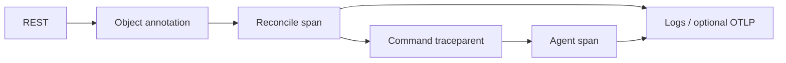

# Observability

Logs, traces, metrics, status, and Events support diagnosis; they do not authorize
migration or deletion cleanup.

## Logs and traces

| Setting / mechanism | Behavior |
| --- | --- |
| Initialization | Once per component, with service name, filter, format, optional OTLP. `RUST_LOG` overrides filtering. |
| Format | Human default. JSON flattens event fields, includes current `span`, omits ancestor list. Trace ID is under `span.trace_id`. Optional span-close events record elapsed work. |
| OTLP absent | Logs only; explicit trace IDs remain usable. |
| OTLP enabled | Batched spans, three-second export timeout, shutdown flush; distinct component service names. |
| `traceparent` | W3C version 00; nonzero IDs. Valid parent retains trace ID/sampling; invalid input creates a root. |
| Propagation | `meister.io/traceparent` object annotation and command fields connect later reconcile work. Outgoing context prefers active OTLP, then explicit fallback. |

Sources: [subscriber](../shared/telemetry/src/lib.rs),
[context](../shared/telemetry/src/traceparent.rs),
[annotations](../shared/controller-api/src/object.rs),
[session fields](../shared/proto/proto/control.proto).

## Metrics

Separate unauthenticated `/metrics` listener; absent/empty address disables it.
One process-wide registry. Names below have prefix `meister_`; histograms also
expose bucket/sum/count series.

| Suffix | Labels | Measures |
| --- | --- | --- |
| `reconcile_pass_duration_seconds` | tier, kind | Pass duration |
| `reconcile_errors_total` | tier, kind | Failed passes |
| `reconcile_last_success_timestamp_seconds` | tier, kind | Last success |
| `objects` | kind | Stored objects |
| `vms` | phase | Controller VM inventory |
| `phase_stuck` | kind, phase, reason | Overdue resources |
| `scheduler_placements_total` | tier | Placements |
| `scheduler_conflicts_total` | tier | Lost binding CAS |
| `scheduler_pending_vms` | tier, reason | Placement blockers |
| `sessions` | kind | Connected peers |
| `heartbeat_age_seconds` | kind, peer | Heartbeat age |
| `etcd_operation_duration_seconds` | operation | Store latency |
| `etcd_errors_total` | operation, result | Store failures |
| `etcd_observed_revision` | — | Observed revision |
| `agent_vms` | phase | Agent records |
| `agent_driver_operation_duration_seconds` | driver, operation | Driver latency |
| `agent_quarantines_total` | — | Quarantine entries |

Labels use bounded categories/configured peers, excluding VM IDs, paths, and error
text. Collectors reset/zero stale series. CAS conflicts can indicate another
replica completed the work, rather than failure.

Source: [metrics and listener](../shared/telemetry/src/metrics.rs).

## Status, events and deadlines

| Signal | Contract |
| --- | --- |
| Phase `since` | Age of current kind; unchanged reports preserve it. Old Running timestamps can be healthy. |
| Heartbeat | Separate freshness signal; shared timeout 30 s. Silence means unknown state, not replacement authority. |
| Events | Aggregate by object UID/reason; count and last-seen advance. One-hour creation lease is retained, not renewed. Best effort; no durable audit/cleanup authority. |
| Stuck budgets | Pending 5 min; Provisioning/Creating/Preparing/Releasing/Receiving 15 min; Unknown 10 min. |
| Exclusions | Resource-specific terminal phases, unlisted phases, future timestamps. |
| Stuck output | Current gauge and event near deadline crossing; controller downtime can miss the event window. No phase change or teardown. |

Diagnosis order: generation/observedGeneration → phase/reason/message → heartbeat
freshness → scheduler blockers/store latency. Distinguish recreated objects by UID.
For migrations, inspect durable attempt evidence; acknowledgments, timeouts, and
error strings are insufficient ownership evidence.

Sources: [Events](../shared/controller-api/src/events.rs),
[deadlines](../shared/controller-api/src/stuck.rs),
[heartbeats](../shared/controller-api/src/heartbeat.rs),
[phases](../shared/controller-api/src/resources/phase.rs), [Migration](MIGRATION.md).
