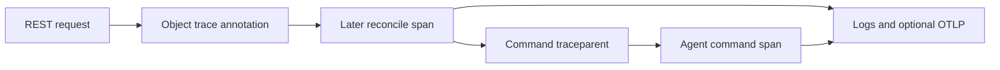

# Observability

Logs explain individual decisions, traces connect work across tiers, metrics show
aggregate behavior, and resource status records the current controller view.
None substitutes for durable migration or deletion evidence.

## Logs and traces

Components initialize telemetry once with a service name, default filter, log
format and optional OTLP endpoint. `RUST_LOG` overrides the default filter. Human
format is the default; JSON flattens event fields into the top-level object and
includes the current span under `span`. It omits the full ancestor span list.
When a span carries `trace_id`, that is where JSON consumers can find it. Components
can enable span-close events to report elapsed work.

Without an OTLP endpoint, the subscriber emits logs only. With one, it also exports
batched spans with a three-second export timeout. Shutdown flushes the provider.
Each component uses its own service name so a trace can cross cloud, cluster and
agent without merging their identities.

Trace context uses W3C version-00 `traceparent`. Invalid values create a new root;
valid values retain trace ID and sampling flags when creating a child span. IDs
must be nonzero. Context is stored in the `meister.io/traceparent` object annotation
and carried explicitly in commands, since later reconcile passes cannot inherit
the original request's task-local span. Outgoing context prefers the active OTLP
span and otherwise uses the explicit fallback. Trace IDs remain useful in logs
when exporting is disabled.

Sources: [subscriber setup](../shared/telemetry/src/lib.rs),
[trace context](../shared/telemetry/src/traceparent.rs),
[object annotations](../shared/controller-api/src/object.rs),
[session fields](../shared/proto/proto/control.proto).

## Metrics

The metrics listener serves Prometheus text at `/metrics` on its own configured
address. An absent or empty address disables it. It is separate from the tenant
API and does not use its authentication middleware; bind and expose it according
to the monitoring network. One process-wide registry owns the metric families.

All names below have the `meister_` prefix. Histogram families also expose their
usual bucket, sum and count series.

| Name suffix | Labels | Use |
| --- | --- | --- |
| `reconcile_pass_duration_seconds` | tier, kind | Pass duration. |
| `reconcile_errors_total` | tier, kind | Failed passes. |
| `reconcile_last_success_timestamp_seconds` | tier, kind | Last successful pass. |
| `objects` | kind | Stored object counts. |
| `vms` | phase | Controller VM inventory by phase. |
| `phase_stuck` | kind, phase, reason | Resources past their phase budget. |
| `scheduler_placements_total` | tier | Successful placements. |
| `scheduler_conflicts_total` | tier | Lost binding CAS attempts. |
| `scheduler_pending_vms` | tier, reason | Placement blockers. |
| `sessions` | kind | Connected peers. |
| `heartbeat_age_seconds` | kind, peer | Time since the last peer heartbeat. |
| `etcd_operation_duration_seconds` | operation | Store latency. |
| `etcd_errors_total` | operation, result | Store failures by bounded category. |
| `etcd_observed_revision` | — | Revision observed by this process. |
| `agent_vms` | phase | Local agent VM records. |
| `agent_driver_operation_duration_seconds` | driver, operation | Driver latency. |
| `agent_quarantines_total` | — | Entries into quarantine. |

Labels use bounded categories and configured peers rather than VM IDs, object
paths or error messages. Inventory collectors reset or explicitly zero series so
removed peers and resolved failures do not remain as stale observations. A CAS
conflict alone is not a failed operation: another replica may have completed the
same work.

Source: [metric definitions and listener](../shared/telemetry/src/metrics.rs).

## Status, events and deadlines

Phase `since` measures time in the current kind. An unchanged report preserves it;
a Running VM with an old timestamp can be healthy. Heartbeat timestamps answer the
separate freshness question. The shared heartbeat timeout is 30 seconds. Lost
contact means unknown runtime state, not permission to create a replacement guest.

Events aggregate by involved object UID and reason, incrementing a count and last
seen time. They use a one-hour etcd lease established at creation; later aggregation
updates preserve that lease rather than extending retention. Recording is best
effort, with failures logged. Events are a diagnostic history, not a durable audit
trail or a source of cleanup authority.

The stuck-phase helper uses budgets of five minutes for Pending, fifteen minutes
for Provisioning, Creating, Preparing, Releasing and Receiving, and ten minutes for
Unknown. Resource-specific terminal phases are excluded; unlisted phases have no
budget. Timestamps in the future are not treated as overdue. The gauge reflects
current overdue objects; a PhaseStuck event is emitted around the deadline crossing,
so it is not guaranteed to be emitted after a controller was offline across that
window. These checks produce observations, never phase transitions or teardown.

For diagnosis, compare the requested generation with observed generation, inspect
phase reason and message, then correlate peer freshness, scheduler blockers and
store latency. Use the object UID to distinguish recreation under the same name.
For an unresolved migration, follow its attempt evidence rather than interpreting
an acknowledgement, timeout or error string as an ownership verdict.

Sources: [events](../shared/controller-api/src/events.rs),
[phase deadlines](../shared/controller-api/src/stuck.rs),
[heartbeats](../shared/controller-api/src/heartbeat.rs),
[phase model](../shared/controller-api/src/resources/phase.rs),
[migration recovery](MIGRATION.md).
