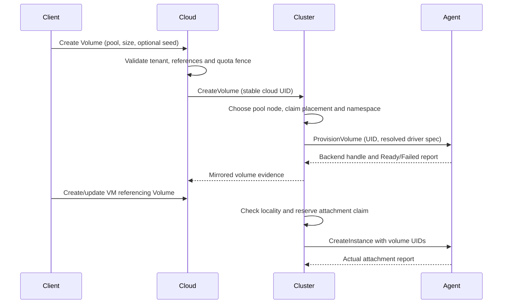

# Storage lifecycle

Storage uses three distinct objects: a `StoragePool` describes a backend and its
reachability, a `Volume` reserves a disk with its own lifetime, and a
`VolumeSnapshot` requests a backend copy. A VM may instead declare an inline disk,
whose bytes belong to that VM's local lifecycle. Deleting a VM detaches referenced
volumes and deprovisions inline disks. An inline disk does not survive a reschedule.

The API handlers are [cloud storage](../components/cloud-controller/src/api/storage.rs)
and [cluster storage](../components/cluster-controller/src/api/volumes.rs).
[Agent volumes](../components/agent/src/volumes.rs) execute backend operations.

## From request to attachment

A cloud pool names one or more serving clusters; a corresponding pool must exist
at the cluster. Volume dispatch prefers `status.cluster`, falling back to the pool
home. Node placement checks the pool's node list and backend capability. It does
not reserve backend free bytes as CPU/memory placement does. Cloud quota is a
logical requested-size limit, not a measurement of available physical storage.
See [cloud dispatch](../components/cloud-controller/src/reconcile/volumes.rs) and
[cluster volume reconciliation](../components/cluster-controller/src/reconcile/volumes.rs).

Drivers report locality. `NodeLocal` pins a VM to the volume node; `Shared`
restricts it to nodes that reach the pool; `Networked` can be attached elsewhere.
Unknown locality provides less placement information, not a guarantee that all
nodes can reach the bytes. Conflicting driver reports are recorded on the pool.
Cross-cluster placement also compares reported pool parameters; it cannot prove
that two similarly configured endpoints expose the same physical data.
[Placement](../components/cluster-controller/src/reconcile/placement.rs) resolves
these dependencies before handing candidates to the scheduler.

Imported namespace pools have a finite claim table in etcd, mapping namespace NQN
to volume UID. CAS on the pool serializes allocation, and retries recover an
existing UID claim. The selected namespace is injected into the agent spec.
Duplicate NQNs across pools are checked on admission, but that check is not a
transaction spanning concurrent pool creation. `allow_local_claims` delegates
allocation to nodes and requires external coordination. See
[namespace allocation](../components/cluster-controller/src/reconcile/namespaces.rs).

## Ownership, resize and movement

`attachedTo` is a controller claim; `openOn` is node evidence. Before dispatching a
VM, the cluster claims its referenced disks. Releasing intent marks the claimant
as gone; the derived claim waits for node open-handle evidence to clear. Agents
also check local holders under their VM operations lock before backend deletion
or forgetting a record. That local serialization does not provide a distributed
storage lease or fencing. [Resource cleanup](RESOURCE_LIFECYCLE.md) covers corrupt
inventory, incomplete inline acquisition and durable cleanup handles.

Volume size may grow. The reconciler persists `untoldGib`, grows the backend, then
notifies the running guest, potentially on another node. A notification failure
retains the obligation after the backend reports its new size; retries need not
grow it again. Shrink is refused. `status.sizeGib` is the node measurement, while
zero means unmeasured. See `resize_volume` in
[volume reconciliation](../components/cluster-controller/src/reconcile/volumes.rs).

Moving a stopped VM across clusters requires pools whose bytes both clusters can
reach. The cloud releases the old cluster's volume record without deprovisioning
and recreates the record at the destination with the same UID. This moves metadata,
not bytes. In-cluster shared-volume records similarly follow a VM's new node.
Unknown ownership or a missing old cluster can delay the handoff. Live migration
adds an explicit attempt and temporary dual-endpoint ownership; its guarantees and
unresolved cases are documented in [Migration](MIGRATION.md). After a successful
live handoff, volume-home updates and source-record forgetting are best effort.
If the home update fails but forgetting succeeds, later storage commands may
still target the former source; the finished migration does not retry this debt.

## Snapshots and seeds

A volume starts empty, from an image, or from a snapshot; both seed kinds together
are refused. A snapshot seed may be pending at admission, but provisioning waits
for Ready and resolves its name to the snapshot UID. The backend implements the
copy or clone; this is not a portable export format.

Snapshot consistency comes from the selected volume node's capability catalogue.
Atomic backends need no controller pause. Otherwise the cluster requests a pause
on a running holder, sends `SnapshotVolume`, then attempts resume. **The current
sequence does not guarantee quiescence for the full copy:** Unknown and other
non-Running holder phases skip the pause, and a Pause acknowledgement can reflect
a blocked desired-state transition. Snapshot work itself is awaited, but no durable
freeze ownership excludes concurrent resume, migration or another writer. Pause
failure returns without a compensating resume, and interruption can stop the
sequence between operations. The filesystem driver's atomic capability probe also
does not prevent its actual copy path from falling back to a non-atomic copy.
These are limits of the implementation, not an application-consistent backup claim.
See [snapshot reconciliation](../components/cluster-controller/src/reconcile/snapshots.rs)
and [agent volume commands](../components/agent/src/commands/volume.rs),
[desired-state reconciliation](../components/agent/src/reconcile/mod.rs) and
[filesystem snapshots](../drivers/filesystem/src/lib.rs).

Two routing limits also matter. Cloud snapshot dispatch still resolves
`pool.spec.cluster`, ignoring a volume's relocated `status.cluster` and the
multi-cluster home helper. Within a cluster, an unassigned snapshot can be claimed
by a replica that does not own the source volume node's session, causing dispatch
failure and retry. Snapshots are taken where their backend bytes exist; these
paths do not automatically transfer them to another cluster.

Deletion is asynchronous. A volume with a VM or undeleted snapshot holder remains
Releasing. A placed volume or snapshot is retained until explicit node `Gone`
evidence; absence from an agent list is not sufficient. The cloud uses complete
cluster inventories to mirror cleanup. Unreachable nodes can therefore leave
resources pending indefinitely, and storage configuration must retain access to
the namespace that created them.

Images are a separate cloud catalogue. Path registrations adopt node files and
are restricted to privileged identities; URL registrations require HTTP(S) and
SHA-256. Node evidence determines readiness. Deleting an image checks VM references
but currently omits Volume base-image references, and cache deletion is best effort
for reachable clusters/nodes. See [image API](../components/cloud-controller/src/api/images.rs).
