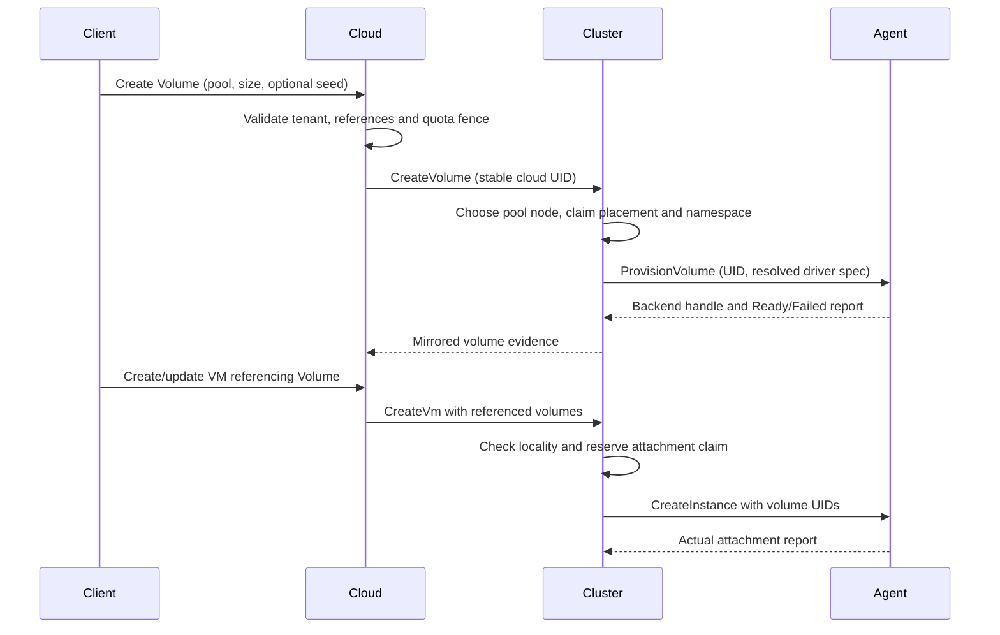

# Storage lifecycle

| Resource | Lifetime / purpose |
| --- | --- |
| StoragePool | Backend configuration and reachability |
| Volume | Disk reservation independent of VM lifetime |
| VolumeSnapshot | Backend copy, not a portable export |
| Inline VM disk | Deprovisioned with the instance; does not survive rescheduling |

Deleting a VM detaches referenced volumes. Sources:
[cloud API](../components/cloud-controller/src/api/storage.rs),
[cluster API](../components/cluster-controller/src/api/volumes.rs),
[agent operations](../components/agent/src/volumes.rs).

## From request to attachment

| Placement input | Rule / limit |
| --- | --- |
| Cloud pool | Names serving clusters; corresponding cluster pools must exist |
| Volume dispatch | Prefers status.cluster, then pool home |
| Node eligibility | Pool node list and backend capability; no reservation of physical free bytes |
| Cloud quota | Logical requested size, not available backend capacity |
| NodeLocal | Pins the VM to the volume's node |
| Shared | Restricts placement to nodes reaching the pool |
| Networked | Requires the backend capability at the destination |
| Unknown locality | Limited evidence, not proof of universal reachability |
| Cross-cluster pool comparison | Detects reported parameter disagreement; cannot prove physical data identity |

Sources: [cloud dispatch](../components/cloud-controller/src/reconcile/volumes.rs),
[cluster volumes](../components/cluster-controller/src/reconcile/volumes.rs),
[placement](../components/cluster-controller/src/reconcile/placement.rs).

Imported namespaces use a pool CAS table mapping NQN → volume UID; retries recover
existing claims and inject the chosen namespace. Cross-pool duplicate-NQN admission
is not atomic across concurrent creates. `allow_local_claims` delegates allocation
to nodes and requires external coordination.
[Implementation](../components/cluster-controller/src/reconcile/namespaces.rs).

## Ownership, resize and movement

| Operation / state | Contract |
| --- | --- |
| attachedTo | Controller claim acquired before VM dispatch |
| openOn | Node handle evidence; claimant departure alone cannot release the claim |
| Agent deletion/forget | Checks local holders under the VM operations lock; no distributed storage lease or fencing |
| Growth | Persist untoldGib, grow backend, notify guest; failed notification remains retryable without regrowing |
| Size | Shrink refused; status.sizeGib is measured size, zero means unmeasured |
| Stopped cross-cluster move | Release old metadata without deprovisioning; recreate with the same UID over shared bytes |
| In-cluster shared move | Volume record follows the VM's destination |
| Missing old owner | Can delay handoff indefinitely |
| Live migration | Explicit attempt and temporary dual-endpoint ownership; see Migration |
| Post-migration cleanup | Volume-home update and source-record forget are best effort; failed update followed by successful forget leaves stale routing without durable retry |

[Resource cleanup](RESOURCE_LIFECYCLE.md) covers corrupt inventory, partial inline
acquisition and cleanup handles. [Migration](MIGRATION.md) defines transfer recovery
limits; [`resize_volume`](../components/cluster-controller/src/reconcile/volumes.rs)
implements growth obligations.

## Snapshots and seeds

- Choose no seed, an image, or a snapshot; combining seed kinds is refused.
- Pending snapshot seeds are accepted, but provisioning waits for Ready and
  resolves the snapshot name to its UID.
- Reported Atomic consistency skips controller pause. Otherwise a Running holder
  receives Pause → awaited SnapshotVolume → attempted Resume.

**The sequence does not guarantee full-copy quiescence or application consistency.**

| Limit | Consequence |
| --- | --- |
| Unknown / non-Running holder | Pause is skipped |
| Pause ACK | Can represent a blocked desired-state transition |
| No durable freeze owner | Concurrent resume, migration or another writer is not excluded |
| Pause failure / interruption | No compensating resume after pause failure; execution may stop between operations |
| Filesystem Atomic claim | Reflink probe does not prevent actual copy fallback to non-atomic I/O |
| Cloud snapshot routing | Uses pool.spec.cluster, ignoring relocated volume status.cluster and multi-cluster home selection |
| Unassigned cluster snapshot | A replica without the volume node session can win the claim, fail dispatch and retry |
| Snapshot movement | No automatic cross-cluster transfer of backend bytes |

Sources: [snapshot controller](../components/cluster-controller/src/reconcile/snapshots.rs),
[agent commands](../components/agent/src/commands/volume.rs),
[agent reconciliation](../components/agent/src/reconcile/mod.rs),
[filesystem driver](../drivers/filesystem/src/lib.rs).

Deletion remains asynchronous:

- VM or undeleted snapshot holders keep a volume Releasing.
- Placed volumes/snapshots require explicit node Gone evidence; list absence is
  insufficient. Cloud cleanup uses complete cluster inventories.
- Unreachable nodes can block completion indefinitely. Backend configuration must
  retain access to the original namespace.

Images use a separate [cloud catalogue](../components/cloud-controller/src/api/images.rs):
privileged path registration adopts node files; URL images require HTTP(S) and
SHA-256; node reports determine readiness. A URL image stays Pending
(`AwaitingNode`) until a node fetches it for its first VM; a node's complete
inventory without the file fails only a path image. Deletion checks VM references but omits
Volume base-image references. Cache removal is best effort on reachable peers.
