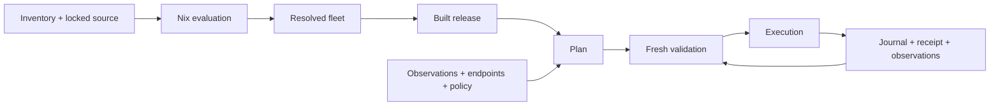

# Deployment model

`meister-deploy` turns an operator inventory into a resolved fleet, built release,
frozen deployment plan, and persisted execution evidence.

## Inventory and resolution

Sources: [inventory.rs](../src/inventory.rs), [manifest.rs](../src/manifest.rs),
[nix.rs](../src/nix.rs).

| Contract | Rules |
|---|---|
| `fleet.toml` | Schema `2`; unknown fields rejected; at least one host required |
| Scalars | Host override, otherwise agreed group value, otherwise default; conflicting groups require a host override |
| Lists | Accumulate profiles, checks, and caches in precedence order; remove duplicates |
| Defaults | SSH `root:22`, boot `uefi`, rollout `max_unavailable = 1`, reboot `approve` |
| IDs | ASCII alphanumeric, `_`, `-`; start alphanumeric; at most 63 bytes |
| DNS names | Lowercase DNS labels; domain labels and total length checked separately |
| Managed hosts | NixOS hosts need roles and a management network; context hosts cannot declare installation |
| Install disk | Serial or WWN plus size; `/dev/` and `/sys/` paths are rejected as identities |
| Persistence | Device references use `label:`, `uuid:`, `partlabel:`, or `serial:`; reinstall preservation must cover protected paths |
| Installer access | Public-key prefixes checked; an empty authorized-key list disables installer SSH |

- Rust reads inventory and applies inheritance; Nix derives deployment settings.
- `meisterDeployment.inventory` supports selection without forcing host system modules.
  Full `meisterDeployment` exports evaluated settings, units, artifacts, and secret references.
- Selected evaluation restricts both host maps, group membership, and host-bound services.
  Excluded systems are not forced by this wrapper.
- Evaluation uses `--no-write-lock-file` and a 600-second timeout. Clean source uses a
  `git+file` reference, optionally pinned to the captured revision; development source uses
  a scanned, materialized snapshot. Explicit flake locking has a 300-second timeout.
- `meister-deploy/nix-manifest/1` is the evaluation contract;
  `meister-deploy/resolved-fleet/1` joins inventory and evaluated hosts.
- Resolution requires matching host maps, valid references, exact requested host coverage,
  and at least one evaluated host. It does **not** check reciprocal agreement between
  `host.groups` and `group.members`; selection reads the former, capacity reads the latter.
- JSON contracts reject unknown fields. Non-optional fields need values unless defaulted;
  `Option` fields accept null or omission. Sizes are bytes; modes are strings such as `0600`.
- Partial resolution records `partial` and `evaluated_hosts`. Planning uses the available
  subset and records its limited scope; it cannot assess excluded systems.
- `resolve --from` records the supplied evaluation's path and digest. This does not prove
  that the supplied evaluation came from the captured source tree.

## Identity and compatibility

Sources: [canonical.rs](../src/canonical.rs), [ids.rs](../src/ids.rs),
[plan.rs](../src/plan.rs).

Content IDs are `<kind>-<full SHA-256>` over canonical JSON. Object keys sort by UTF-8;
array order remains significant; strings and numbers use `serde_json` encoding; whitespace
is omitted. Changing any retained field changes the ID.

| ID | Excluded fields |
|---|---|
| Manifest | `manifest_id`, `created_at`, `tool`, `source.repo_path` |
| Release | `release_id`, `created_at`, `build_env`, `required_checks[].duration_ms` |
| Plan | `plan_id`, `created_at`, `expires_at`; approval `bound_plan_id` values cleared before hashing |
| Run | UUIDv7 event identity, not a content hash; repeated runs of one plan have distinct IDs |

- Exclusions apply to the listed paths, not recursively to every similarly named field.
- Source metadata binds revision/tree or development snapshot, inventory and lock digests;
  the operator repository's absolute path is excluded from manifest identity.
- Release identity retains check identities and outcomes; plan identity retains frozen
  actions, endpoints, evidence, policy, and approval requirements.
- Unused optional action fields, including provider-boot and expected-file digest fields,
  are omitted; an empty rotation map is omitted. These defaults preserve older plan IDs.
- Parsed resolved fleets and plans verify their content IDs; schema versions remain explicit.
- SSH host-key enrollment and service certificate enrollment are separate facts.
- Certificate subjects depend on the requested role: node host ID, or rendered cloud/cluster
  name. `meister-ca` local lookup uses host ID and destination basename, not `source.ref`.
  See [pki.rs](../src/pki.rs).
- Default multi-role hosts share one identity key/certificate path. `keys csr --as` chooses
  one role; it does not provision separate identities for every service. Use separate tier
  hosts/VMs unless providing a separately validated per-role PKI configuration.

## Plan contents and decisions

Source: [plan.rs](../src/plan.rs).

| Input or output | Meaning |
|---|---|
| Selector | `all`, `host=`, `group=`, `role=`, `profile=`, `site=`; comma union with ordered exclusions; exclusion cannot be first |
| Frozen scope | Sorted host IDs and endpoint map; unreachable selections remain visible |
| Inputs | Release, observation, endpoints, policy, and supplied time; core planning performs no I/O |
| Host verdicts | `unchanged`, `change`, `blocked`, `unreachable`, `unenrolled` |
| Action evidence | Preconditions, unknowns, disruptions, rollback mode, dependencies, wave and parallel group |
| Default validity | One hour; activation confirmation: 300 seconds for switch, 900 seconds for boot |
| Approval grants | Explicit `<class>=<plan_id>`; each required class needs its own matching grant |

- Selected hosts need release artifacts. Changed identities, missing enrollment, open
  transactions, activation locks, missing required mounts, or failed hardware checks can block work.
- Hardware preflight compares declared capabilities, PCI devices, NIC MACs, and available
  space with observations. Missing device evidence blocks declared devices; unknown free
  space is reported without proving that a closure fits.
- Required mounts are checked by mount presence, not by verifying the declared backing device.
- Current and next-boot systems matching the release may be unchanged even when booted-system
  evidence is absent. A known different booted generation can produce a reboot-only plan.
- Kernel, initrd, and parameter hashes determine normal reboot necessity. Missing boot
  evidence for a changed system conservatively requests reboot.
- Enrolled agents require configured workload control for cordon/drain before changes.
  Unenrolled bootstrap agents skip maintenance because they have no authenticated registration.
- **Standalone limit:** agents without identity references are observed as enrolled. Changed
  standalone generations therefore require controller maintenance even without a controller.
  Initial installer provisioning can install the desired generation directly; later changes
  need operator-managed NixOS activation and explicit handling of local guests.
- Bootstrap delivers available local credentials; target-generated private keys stay on the
  target. Public-file delivery binds content digests; private files use presence evidence.
- Settled systems with credential drift can receive delivery-only actions. Rotation uses
  prepare/overlap/switch/verify/remove; revocation distributes CRLs without reader restarts.
  Retirement distributes revocations to remaining hosts; it does not erase the retired host.
- Preflight and verification remain visible for reporting even when disruptive actions are blocked.

## Ordering, capacity, and boot modes

Source: [plan.rs](../src/plan.rs).

- Bootstrap/retirement orders declared prerequisites first; upgrades reverse dependency
  direction. Mixed-role hosts occupy their highest service tier and receive one host sequence.
- Topological ordering is deterministic, using tier, hardware class, explicit class rank,
  and host ID. Canary work precedes other hosts in its class while respecting dependencies.
- Explicit `canary_class` wins; inferred classes use kernel version, profiles, GPU model,
  and NIC names/RDMA. They are not hashes of all hardware or hypervisor configuration.
- Raft outage budget is `floor((n - 1) / 2)` minus current unavailable members, capped by
  `max_unavailable`. Waves still permit at most one member of each raft group.
- Singletons require explicit outage approval. Entirely unavailable groups retain recovery
  capacity; repairing an already-unavailable member does not consume another serving member.
- Compute/custom group concurrency uses `max_unavailable` without subtracting existing outages.
- Reported etcd membership is compared with rendered names/peer URLs; when rendered peers
  are absent, comparison falls back to names/host IDs. Empty reports supply no topology evidence.
  Membership migration is not implemented as a deployment sequence.

| Boot mode | Planned behavior and recovery |
|---|---|
| UEFI | Supports systemd-boot one-shot fallback for boot activation |
| GRUB | Switch activation and separate local reboot; no automatic boot fallback |
| Direct | Switch and confirm userland, then stop for provider reboot using the release bundle; resume after external boot |
| Installation | Preflight/install/verify from the installer medium; ordinary workstation apply refuses install actions |

- First-install planning accepts absent or unreachable observations. Without an enrolled SSH
  fingerprint, normal observation marks the host unreachable without opening SSH.
  A responding host requires explicit reinstall policy.
- Planning does not prove a disk is blank. Installation requires declared disk identity,
  size, preservation rules, and target-side confirmation.
- Approval classes are `disruptive`, `quorum`, `reboot`, `singleton`, and `destructive`;
  an action's displayed class does not replace the plan's union of required classes.
- **Current reboot limit:** a reboot-only plan with unchanged boot artifacts can emit a reboot
  while `reboot_required` is false, bypassing `reboot = never` and the separate reboot approval.
- **Current topology limit:** the unavailable-member repair exemption also bypasses a group's
  topology block, including during fresh validation. Do not treat it as membership-migration approval.

## Readiness and fresh evidence

Sources: [checks.rs](../src/checks.rs), [readiness.rs](../src/readiness.rs),
[plan.rs](../src/plan.rs).

| Status | Blocks when required? |
|---|---|
| `pass`, `not_applicable` | No |
| `fail`, `unknown`, `skipped` | Yes |

- Identity, enrollment, and system checks are always required; other checks follow inventory.
  Without a release, the system check is not applicable. Next-boot and booted checks are separate.
- Session readiness proves the session-bearing unit is active and, for agents, a local
  socket exists. It does not prove certificate acceptance or an authenticated upstream session.
- Credential readiness checks presence and rejects parsed group/other permission bits.
  It does not validate owner or reject missing/unparseable mode metadata.
- Host etcd readiness is local endpoint health; planner quorum decisions combine member evidence.
- Managed services use host checks. An unanswered unmanaged service is unknown and blocks
  acceptance only when declared required.
- Fresh validation checks release/artifact identity, reachability, SSH/machine identity,
  new locks/transactions, system movement, and group capacity for the next disruption.
  Expired plans or changed systems require replanning; unsafe identity or concurrency changes stop.
- Synthetic fixtures exercise contracts and ordering; they are not hardware or deployment evidence.

## Persisted state and restart

Source: [state.rs](../src/state.rs).

| Under `.meister-deploy/` | Purpose |
|---|---|
| `lock` | Repository operator/run/PID/workstation record; target activation locks are separate |
| `observations/latest.json`, timestamped JSON | Latest observation and retained history |
| `runs/<run>/plan.json`, `release.json` | Applied inputs retained for resume |
| `runs/<run>/journal.jsonl`, `receipt.json` | Sequenced events and folded result |
| `runs/<run>/observations/`, `ledger.json`, `verify.json` | Run observations and verification evidence |
| `gcroots/` | Retained release roots; removing roots permits later Nix garbage collection |
| `retired/<host>.json` | Retirement time, last observed system, revoked serials, optional reason |

- Journal append assigns sequence numbers, redacts registered secrets, appends, and fsyncs.
  Callers must serialize appends and record irreversible intent before execution.
- Resume repairs an unterminated last record: retain valid JSON and add its newline, or drop
  an invalid fragment. Invalid complete records fail parsing. Input decoding is lossy UTF-8.
- Locks use exclusive creation and have no age expiry. Same-run dead local holders may be
  succeeded; other ownership changes require explicit takeover and record revalidation.
- **Lock limit:** same run ID and PID count as re-entry without comparing workstation, so a
  shared state directory is not a reliable distributed lock when PIDs coincide.
- Observation history names have second precision; multiple saves in one second replace an entry.
- Retention defaults: keep three release roots; no age guard; leave observations and runs alone.
  Count and optional age protection both apply. Undated roots and `latest.json` are retained.
- Run removal requires opt-in and a successful completed receipt. Failed/partial runs remain.
  **Current retention limit:** the run-file allowlist omits `release.json`, `ledger.json`, and
  `verify.json`; their presence prevents deletion as unknown content.
- Embedded `init` files are local; `init` separately attempts `nix flake lock`.
  **Template limit:** the embedded list omits imported `profiles/single-node.nix`; selecting
  that profile requires the file from the same source revision. See [template.rs](../src/template.rs).
